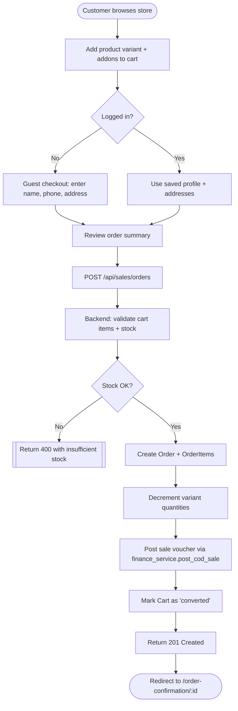
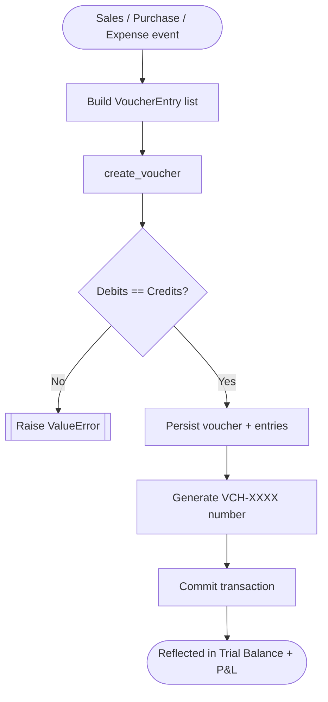
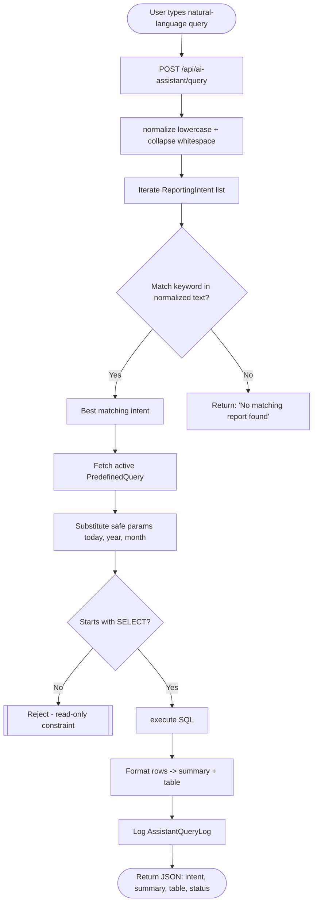
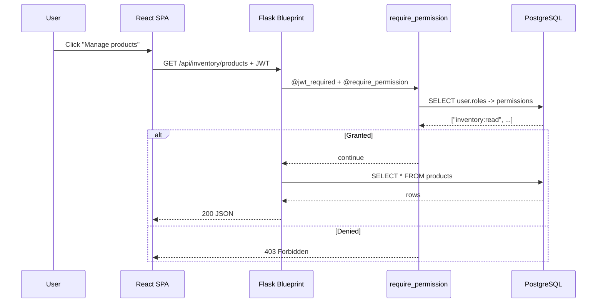

# Chapter 5 — Implementation

This chapter walks through the implementation of the major features. For each feature it states the purpose, the user-visible flow, the back-end flow, the file references that the reader can inspect in the repository, and either a flowchart, pseudocode or an annotated code snippet. The supervisor's recent guidance asked for explicit explanations alongside every diagram, snippet and algorithm; we follow that guidance throughout.

## 5.1 Project Layout

```text
backend/
  app/
    __init__.py            # create_app factory + logging
    config.py              # Env-driven config
    extensions.py          # db, jwt, bcrypt, cors, migrate
    auth/decorators.py     # require_permission(code)
    models/                # 10 model files (~1.8 kLOC)
    routes/                # 7 blueprints (~2.1 kLOC)
    services/              # finance / inventory / ai_assistant
    seed.py                # idempotent seeders
  migrations/              # Alembic versions
  tests/                   # pytest suite
frontend/
  src/
    Layout.jsx             # storefront chrome
    AuthContext.jsx        # JWT + cart state
    api.js                 # centralised API client
    pages/                 # storefront + admin pages
    components/            # CartDrawer + shared components
    index.css              # design system v2
docs/                      # architecture, ERD, weekly reports
Documentation/             # academic specs + final report
```

The directory layout mirrors the architectural decomposition described in Chapter 4: subdomains live in their own folders, the React app is split by routing surface, and academic documentation lives separately from technical documentation.

## 5.2 Authentication and RBAC

### Purpose
Every administrative action must be attributable to a user, and every endpoint must be guarded by an explicit permission. Customers, by contrast, can browse and check out without an account.

### User flow
A staff member navigates to `/admin/login`, submits their credentials, receives a JWT and is redirected to the dashboard. The token is stored in `localStorage` under `iwear_admin_token` and attached to subsequent requests by the central API client (`frontend/src/api.js:getAuthHeaders`). The customer flow uses a parallel `iwear_user_token` so that admin and customer sessions can coexist in the same browser.

### Backend flow
The `auth_bp` blueprint exposes `/api/auth/login`. On a successful credential check, it creates an access token whose `sub` claim is the user id and returns it in JSON. Every protected route is then decorated with `@jwt_required()` and `@require_permission("permission_code")`. The decorator joins `users → user_roles → roles → role_permissions → permissions` and returns 403 if the permission is missing.

### Code snippet — `require_permission` decorator
File: `backend/app/auth/decorators.py`

```python
from functools import wraps
from flask import jsonify
from flask_jwt_extended import jwt_required, get_current_user

def require_permission(code: str):
    def decorator(fn):
        @wraps(fn)
        @jwt_required()
        def wrapper(*args, **kwargs):
            user = get_current_user()
            if user is None:
                return jsonify({"error": "auth required"}), 401
            granted = {p.code for r in user.roles for p in r.permissions}
            if code not in granted:
                return jsonify({"error": "forbidden", "needed": code}), 403
            return fn(*args, **kwargs)
        return wrapper
    return decorator
```

The decorator is the single point of enforcement for every protected endpoint in the system. Because it lives in one file, security audits and policy changes are localised. The role-permission matrix itself is data-driven and seeded by `seed.seed_role_permissions`.

## 5.3 Catalog and Inventory Management

### Purpose
Store staff need to maintain a catalog of products, variants and addons, and to track stock movements over time.

### User flow
An administrator opens *Products* in the back office. They can search, paginate and filter the list, click *Add product* to launch the form, set price and quantity, attach images and toggle whether the product is active. The form lives in `frontend/src/pages/admin/AdminProductForm.jsx`.

### Backend flow
Product CRUD is implemented in `backend/app/routes/inventory.py`. Each write endpoint requires `inventory:write`. Image upload uses `multipart/form-data` against `/api/inventory/products/<id>/images` and stores files under `backend/uploads/products/`. Public catalog reads go through `backend/app/routes/sales.py:list_products`, which now supports `category_id`, `brand_id`, `type_id`, `min_price`, `max_price`, `search` and `sort` parameters.

### Code snippet — public product listing with filters
File: `backend/app/routes/sales.py`

```python
@sales_bp.get("/products")
def list_products():
    page = request.args.get("page", 1)
    per_page = request.args.get("per_page", 20)
    category_id = request.args.get("category_id", type=int)
    brand_id = request.args.get("brand_id", type=int)
    type_id = request.args.get("type_id", type=int)
    min_price = request.args.get("min_price", type=float)
    max_price = request.args.get("max_price", type=float)
    sort = (request.args.get("sort") or "").strip().lower()
    search = (request.args.get("search") or "").strip()

    q = Product.query.filter(Product.active.is_(True))
    if category_id is not None: q = q.filter(Product.category_id == category_id)
    if brand_id is not None:    q = q.filter(Product.brand_id == brand_id)
    if type_id is not None:     q = q.filter(Product.type_id == type_id)
    if min_price is not None:   q = q.filter(Product.price >= min_price)
    if max_price is not None:   q = q.filter(Product.price <= max_price)
    if search:                  q = q.filter(Product.name.ilike(f"%{search}%"))

    if sort == "price_asc":   q = q.order_by(Product.price.asc().nullslast())
    elif sort == "price_desc":q = q.order_by(Product.price.desc().nullslast())
    elif sort == "newest":    q = q.order_by(Product.id.desc())
    else:                     q = q.order_by(Product.id)
    ...
```

The block above shows how each filter is composed onto the SQLAlchemy query incrementally. The same pattern is used in the admin listing endpoint, which adds an `active=False` toggle for inactive products.

## 5.4 E-commerce: Cart and Checkout

### Purpose
Customers must be able to add products (optionally with addons), manage their cart and place a cash-on-delivery order. Both guest and authenticated paths are supported.

### Flowchart
Source file: `docs/architecture/flowcharts/order_checkout_flow.mmd`

**Figure 5.1 — Order Checkout Flow**



### Explanation
The flow starts at the storefront. Once the customer triggers checkout, the backend validates inventory before creating any rows. If stock is insufficient the request is rejected with 400; otherwise the order, its items, the inventory decrement and the corresponding finance voucher are created in a single transaction. The cart is then marked as `converted` so it cannot be reused. The customer is redirected to a confirmation page where the order number and totals are visible.

The implementation lives in `backend/app/routes/sales.py` (look for the `create_order` handler) and uses the helper `_next_order_number` to generate `ORD-XXXX` style numbers atomically.

## 5.5 Eyewear Customisation and Prescription Capture

### Purpose
Eyewear products are not the same as t-shirts: they need lens parameters and, for prescription frames, optical values. iWear models this with the `addons` group system and the dedicated prescription tables.

### How it works
When the customer opens a frame product, the product detail page (`frontend/src/pages/ProductDetail.jsx`) fetches the addon groups available for the product's category through `/api/sales/products/:id`. Each addon group (e.g. *Lens Options*) is rendered as a collapsible section, each option (e.g. *Single Vision*) as a selectable card. When the user adds the configured product to the cart, the selected `addon_option_ids` travel as part of the body to `POST /api/sales/carts/.../items`. The backend stores them in the `cart_item_addons` junction table.

For prescription products, the customer also fills in left- and right-eye sphere, cylinder, axis and PD values. These are persisted in `prescription_records` and `prescription_details` and linked back to the order. The schema is defined in `backend/app/models/eyewear.py`.

## 5.6 Finance: Double-Entry Voucher Posting

### Purpose
Every sale, purchase and expense must produce a balanced double-entry voucher so that the trial balance and P&L reports remain accurate.

### Pseudocode — `create_voucher`
```text
function create_voucher(voucher_type, entries, ref_type, ref_id):
    debit_total  := sum(e.debit for e in entries)
    credit_total := sum(e.credit for e in entries)
    if debit_total != credit_total:
        raise ValueError("voucher unbalanced")
    voucher := new Voucher(
        voucher_type_id = voucher_type.id,
        voucher_number  = next("VCH"),
        voucher_date    = today(),
        reference_type  = ref_type,
        reference_id    = ref_id,
    )
    persist(voucher)
    for e in entries:
        persist(VoucherEntry(voucher_id=voucher.id, **e))
    commit()
    return voucher
```

**Figure 5.2 — Voucher Posting Flow** (source: `docs/architecture/flowcharts/voucher_posting_flow.mmd`).



### Explanation
The double-entry rule is enforced before any rows are written. This is the key invariant of the finance module — without it, any later report would be unreliable. `post_cod_sale` is a helper that constructs the right entries for a cash-on-delivery sale (debit *Accounts Receivable*, credit *Sales Revenue*) and then calls `create_voucher`. The unit test `tests/test_finance.py::test_voucher_raises_when_unbalanced` proves the invariant.

## 5.7 AI Business Insights Assistant

### Purpose
Store owners with no SQL or BI training need to ask questions of their data in plain English. The AI assistant maps a normalised query to one of a curated set of `ReportingIntent` rows, runs the associated `PredefinedQuery` and returns a structured response.

### Pseudocode — intent detection
```text
function detect_intent(query):
    normalized := lower(strip(query))
    if normalized is empty: return None
    words      := set(split(normalized))
    best       := None
    best_score := 0
    for intent in ReportingIntent.all():
        for kw in intent.intent_keywords:
            kw_lc := lower(kw.keyword)
            if kw_lc in normalized OR kw_lc in words OR any(w in kw_lc for w in words):
                score := length(kw_lc)
                if score > best_score:
                    best_score := score
                    best       := intent
        if normalized contains lower(intent.name) or lower(intent.code):
            if 3 > best_score:
                best       := intent
                best_score := 3
    return best
```

**Figure 5.3 — AI Intent Detection Flow** (source: `docs/architecture/flowcharts/ai_intent_flow.mmd`).



### Explanation
Two safety properties are encoded in the algorithm. First, only `SELECT` statements are accepted, and only after substitution of an internal whitelist of parameters (today, year, month, day). User text never reaches the SQL engine. Second, every call is logged in `assistant_query_logs` with the actor and the matched intent, so the operator can audit who asked what. The implementation lives in `backend/app/services/ai_assistant_service.py` and is exercised by the unit tests in `tests/test_ai_assistant.py`.

The new `AdminAIInsights` React page (`frontend/src/pages/admin/AdminAIInsights.jsx`) consumes these endpoints with a chat-style UI that fetches the available intents on mount and lets the user click a suggestion or type a free-form query.

## 5.8 RBAC at Request Time

**Figure 5.4 — RBAC Request Flow** (source: `docs/architecture/flowcharts/rbac_request_flow.mmd`).



Each request is authenticated, authorised and audited before any business logic runs. The pattern is uniform across all blueprints, which is a deliberate decision to make the security boundary obvious.

## 5.9 UI/UX Redesign

Although the existing storefront and admin had functional CSS, the visual identity was weak: a flat slate-and-blue palette, no hero, no imagery placeholders, minimal hierarchy. The v2 design upgrade in `frontend/src/index.css` introduces:

- A new design-token layer (warm neutrals, indigo accent, amber highlight, refined shadows and rounded radii).
- A modern hero on the storefront landing page with eyebrow, gradient title, action buttons, meta strip and a stylised SVG.
- A filter sidebar with category, brand, price range and sort controls — all wired into the new backend filter parameters.
- Modern product cards with image-forward layouts, pill badges, hover lift and skeleton loaders.
- An admin sidebar with accent active-state, dashboard stat cards with iconography and a recent-orders table.
- A chat-style AI assistant page with a suggestion sidebar and a body that renders both summary text and structured tables.
- A redesigned footer with a four-column grid and a secondary copyright row.

The full CSS lives in `frontend/src/index.css`. New JSX additions are isolated to the files updated in this chapter and to a new `frontend/src/pages/admin/AdminAIInsights.jsx` component that consumes the AI endpoints.

## 5.10 Logging and Observability

`backend/app/__init__.py` now configures a single stream handler with a structured format, so backend operators see consistent timestamps and log levels. `LOG_LEVEL` is read from the environment, defaulting to `INFO`. SQLAlchemy's chatty engine logger is pinned to WARNING to avoid noise during normal operation.

## 5.11 Seed Data for Demo and Testing

The seeder in `backend/app/seed.py` is fully idempotent. Running `flask seed` populates roles, permissions, role-permission mappings, order statuses, payment types, voucher types, the chart of accounts, eyewear masters, AI intents, an admin user and a small set of demo products and addon options. Re-running the command does not duplicate any rows. The new `seed_demo_products` function in particular ensures that the storefront has eight demo frames with descriptions, prices, default variants and a *Lens Options* addon group.
