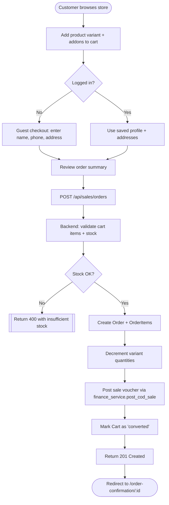
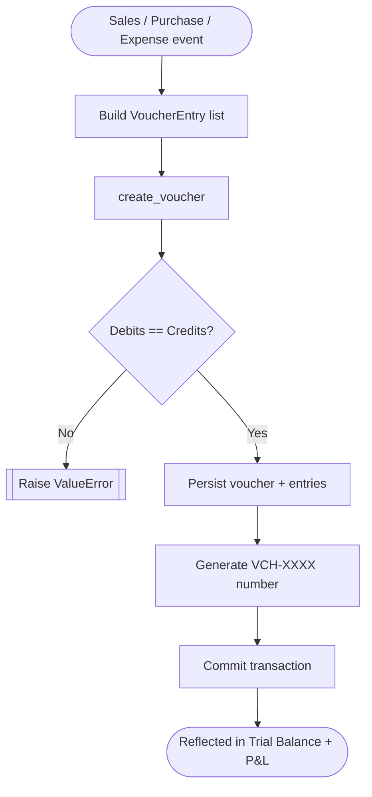
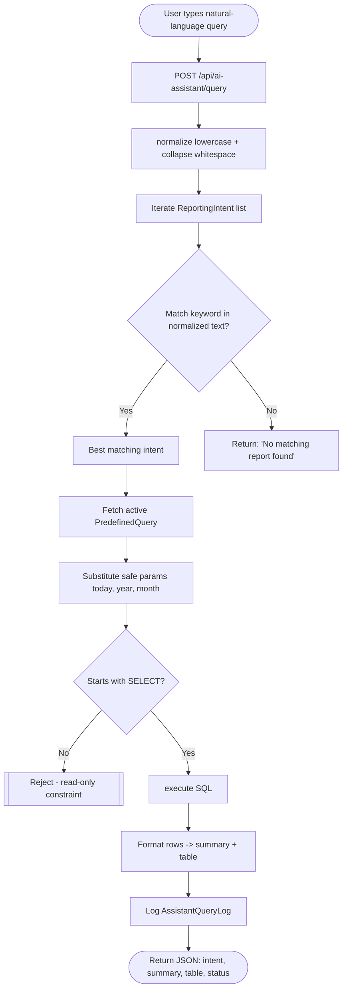
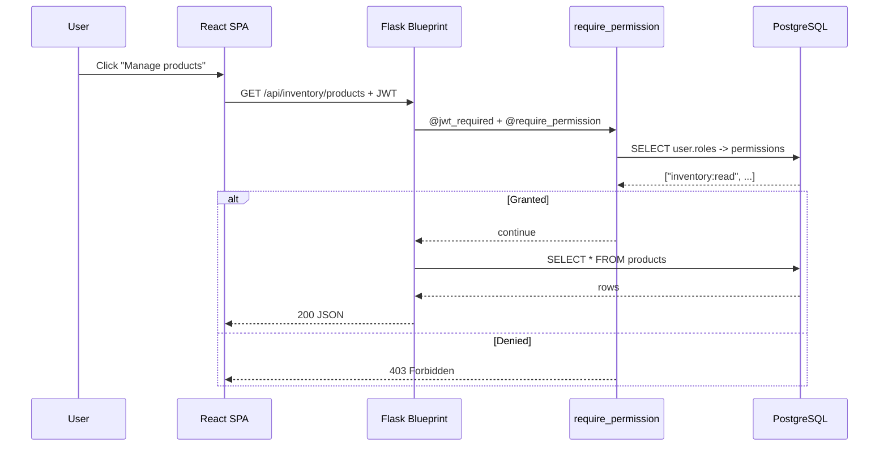

# iWear

## An AI-Enabled Web-Based Eyewear Inventory and E-Commerce Management System with an AI Business Insights Assistant

### MSc Masters Project — Final Report

Supervisor: Tariq Alsboui

Group members:

- [Member 1 Name] — [Banner ID 1] — Inventory Management & Stock Control
- [Member 2 Name] — [Banner ID 2] — E-commerce Customer Experience & Customisation
- [Member 3 Name] — [Banner ID 3] — AI Business Insights Assistant
- [Member 4 Name] — [Banner ID 4] — System Integration, Security & Architecture

### Declaration of Originality and Use of Generative AI

We confirm that this report is the work of the named members above. All sources have been acknowledged and any use of generative AI tools is declared in the appropriate place. The contents have not been submitted, in whole or in part, for any other academic award.

### Abstract

The eyewear retail sector is shaped by a unique combination of medical and commercial requirements. Customers expect online catalogues, prescription customisation and fast checkout, while retailers need accurate stock tracking, accounting and decision support. Generic e-commerce platforms rarely satisfy both sides at once, and small and medium-sized optical retailers (SMEs) frequently rely on disconnected spreadsheets and ad-hoc tools. This project, *iWear*, designs and implements an integrated, modular web platform that unifies inventory management, an eyewear-aware e-commerce storefront, double-entry finance posting, role-based administration and a natural-language AI Business Insights Assistant. The system is built as a three-tier application using React, Flask and PostgreSQL, with JWT-based authentication, an Alembic-migrated database of forty tables and an extensible service layer. Eyewear-specific features such as frame and lens type catalogues, prescription capture and lens addons are first-class citizens of the data model. The AI assistant maps natural-language phrases to predefined safe SQL queries, enabling non-technical store owners to ask questions such as "sales today" or "monthly profit" and receive structured answers. Functional and unit tests, manual end-to-end scenarios and a redesigned user interface confirm that the system delivers the originally proposed scope. The report describes the requirements, design, implementation, testing, results and reflections of the four-member project team.

### Table of Contents

1. Introduction
2. Background & Literature Review
3. Requirements Analysis
4. System Design
5. Implementation
6. Testing
7. Results & Discussion
8. Conclusion & Future Work
9. References
- Appendix A — Individual Reflections (Members 1–4)
- Appendix B — Project Process Document
- Appendix C — Annotated Code Snippets

### List of Figures

- Figure 4.1 — System Architecture (three-tier overview)
- Figure 4.2 — Entity Relationship overview
- Figure 5.1 — Order Checkout Flow
- Figure 5.2 — Voucher Posting Flow
- Figure 5.3 — AI Intent Detection Flow
- Figure 5.4 — RBAC Request Flow
- Figure 7.1 — Storefront home page (placeholder for screenshot)
- Figure 7.2 — Admin AI Insights chat (placeholder for screenshot)

### List of Tables

- Table 3.1 — Functional Requirements
- Table 3.2 — Non-Functional Requirements
- Table 6.1 — Automated test coverage summary
- Table 7.1 — Functional acceptance scenarios


# Chapter 1 — Introduction

## 1.1 Context and Motivation

Digital transformation has become a defining characteristic of contemporary retail. Customers now expect to discover products online, compare prices, customise their purchases and receive support through digital channels. For retailers, web-based systems offer benefits that go beyond a single sales channel: real-time stock visibility, integrated accounting, customer analytics, and the ability to respond quickly to demand patterns. Yet this shift is uneven. Large enterprises invest in expensive enterprise resource planning (ERP) systems, while many small and medium-sized enterprises (SMEs) still depend on a patchwork of spreadsheets, paper records and consumer-grade tools. The eyewear sector is a particularly clear example of this gap: optical retailers manage prescription data, frame variants, lens options and stock locations in environments where data accuracy is critical for customer health and operational efficiency.

Generic e-commerce platforms (Shopify, WooCommerce and similar) offer broad coverage of common retail flows but rarely model eyewear-specific concepts such as prescriptions, lens indices and frame measurements. Conversely, enterprise optical software is typically expensive, hard to customise and inaccessible to independent retailers. The result is an unmet need for a lightweight, domain-aware system that combines storefront capabilities with operational management tools at a cost and complexity that suit SMEs.

## 1.2 Project Aim

The aim of this project is to design and implement *iWear*, an AI-enabled web-based eyewear inventory and e-commerce management system that unifies stock control, an online storefront, prescription-aware product customisation, double-entry finance and a natural-language business insights assistant within a single, modular web platform.

## 1.3 Objectives

To meet this aim, the project pursued the following measurable objectives:

1. Analyse the requirements of an SME eyewear retailer and translate them into functional and non-functional specifications.
2. Design a normalised relational database that captures eyewear-specific entities (frame types, lens types, lens indices, prescriptions) alongside generic e-commerce entities (carts, orders, payments).
3. Implement a Flask REST API exposing role-based endpoints for catalog, inventory, sales, finance, settings and AI assistant operations.
4. Implement a React single-page application that delivers a polished customer storefront and a complete administrative back office.
5. Implement an AI Business Insights Assistant that maps natural-language queries to safe predefined SQL templates.
6. Validate the system through automated unit/integration tests and manual scenarios that exercise the end-to-end customer journey.
7. Document the design, implementation and evaluation in a structured academic report aligned with the supervisor's recent guidance.

## 1.4 Scope

The system is scoped as a functional prototype that demonstrates a credible end-to-end retail experience. The storefront supports browsing, searching and filtering products, managing a cart, customising lens options, capturing prescription data where required, and placing cash-on-delivery orders. The admin portal enables product, addon, customer, order, country and order-status management as well as access to the AI assistant. Online payment integration, courier APIs, full multi-tenant support and machine-learning intent classification are explicitly out of scope and discussed as future work.

## 1.5 Group Project Structure

The project is delivered by a team of four MSc students. Member 1 leads inventory management and stock control, including the catalog admin portal and stock movement schema. Member 2 leads the customer e-commerce experience, including product detail, cart, checkout and prescription capture. Member 3 leads the AI Business Insights Assistant, including intent definitions, the keyword matcher and the chat interface. Member 4 leads system integration, RBAC, security, deployment and the architectural artefacts. The four streams are coordinated through a shared Git workflow on the branch `claude/eyewear-project-completion-UhFBd` and a common Flask + React codebase.

## 1.6 Report Structure

Chapter 2 surveys the academic and industry context. Chapter 3 derives requirements from the project specifications. Chapter 4 presents the system design and architecture. Chapter 5 describes the implementation, including code references, flowcharts and pseudocode. Chapter 6 covers testing. Chapter 7 reports results and discusses limitations. Chapter 8 concludes and outlines future work. References and appendices follow, including individual reflections and a process document.


# Chapter 2 — Background and Literature Review

## 2.1 Introduction

The literature review situates the iWear project within four related streams of academic and industry work: digital transformation in SME retail, eyewear-specific information systems, modular service-oriented web architectures, and natural-language access to business data. The review draws on the project's own *Literature Review* document and on widely cited public sources to identify the gap that iWear addresses.

## 2.2 Digital Transformation in SME Retail

The shift from manual record-keeping to integrated digital systems is well documented across the retail literature. Studies of SME adoption (e.g. OECD, 2021) consistently find that small retailers struggle to invest in enterprise-grade ERP solutions and instead rely on fragmented combinations of spreadsheets, point-of-sale (POS) hardware and consumer cloud services. The same studies report that this fragmentation directly contributes to inventory inaccuracies, delayed reporting and reduced customer trust. The need is therefore not for *more* features, but for *integrated* features delivered at a price and complexity that match SME constraints.

Several authors emphasise that successful SME systems share three properties: low total cost of ownership, modular extensibility, and data consolidation across the operational subdomains (sales, inventory, finance, customer). iWear is designed against this background — it deliberately avoids bespoke enterprise integrations and instead packages a coherent set of subdomains within a single open codebase.

## 2.3 Eyewear Retail as a Distinct Domain

Eyewear retail differs from generic retail in three ways. First, products are highly variable: a single frame may exist in many colours and sizes, and a single sale may include lens choices that are themselves parameterised by index, coating and prescription. Second, prescription data is medical in nature and demands accurate capture and storage. Third, the customer journey often spans an in-store fitting and an online or off-site lens fulfilment step. None of these properties are first-class in mainstream e-commerce platforms, which typically model only generic product variants and rely on free-text fields or manual phone follow-ups for prescriptions.

A small body of academic work has examined optical retail information systems specifically. These studies argue that without prescription-aware data models, the resulting systems force users to bypass the software for the parts of the workflow that matter most — exactly the integration failure that the literature on SME digital transformation warns against.

## 2.4 Modular Web Architectures

The transition from monolithic web applications to modular and service-oriented architectures is a long-running theme in the software engineering literature. Modular systems offer scalability, maintainability and the ability to evolve subdomains independently, but at the cost of increased integration complexity, eventual consistency issues and the need for stricter API contracts.

For the SME context that iWear targets, full microservice architectures are usually disproportionate. The literature suggests a middle path: a *modular monolith* where blueprints, packages or modules represent subdomains within a single deployable artefact. This pattern preserves architectural separation while keeping deployment, monitoring and authentication simple. iWear adopts this pattern explicitly: each Flask blueprint represents a subdomain (auth, sales, inventory, finance, AI, settings), but the entire backend ships as one Flask app.

## 2.5 Authentication, Authorisation and Audit

JSON Web Tokens (JWT) and role-based access control (RBAC) are now standard for stateless API security. The literature highlights the importance of granular permissions over coarse role checks, particularly in multi-user retail environments where finance, inventory and sales staff need different rights. iWear implements a permission code system (`inventory:read`, `finance:post`, `ai:query`, etc.) inspired by these recommendations and exposes a `require_permission` decorator that wraps every protected endpoint.

Audit logging is similarly emphasised in security literature. Sales and finance events in particular benefit from immutable trails. iWear includes an `audit_logs` table for action tracking and an `assistant_query_logs` table that records every AI query with its outcome.

## 2.6 Natural Language Interfaces to Databases

Natural-language interfaces to databases (NLIDBs) are an active research area. Early NLIDBs relied on grammar parsing and keyword matching; recent work uses transformer language models to translate questions directly into SQL. Production systems often combine the two approaches, using machine learning to interpret intent and predefined SQL templates to safeguard against injection or runaway queries.

For iWear, the AI assistant is deliberately scoped to the *predefined query* end of this spectrum. Each business question is mapped to a curated SQL template parameterised only with safe internal values such as the current date. This trades broad linguistic coverage for predictability and safety — a sensible trade-off for an SME tool that must be maintainable by a small team. Future work (Chapter 8) discusses how a transformer-based intent classifier could replace the keyword matcher without changing the safe-query backend.

## 2.7 Double-Entry Accounting in SME Software

Accounting literature is unanimous that double-entry bookkeeping is the appropriate model for any system that posts financial transactions. The principle is simple — every voucher must balance debits against credits — but the implications for software design are non-trivial: the schema must support multiple entries per voucher, validate balance on persistence, and produce reports such as trial balance and profit-and-loss from the underlying ledger rather than from sales metadata alone. iWear implements these requirements in its `finance_service` module, with `create_voucher` enforcing balance and `post_cod_sale` automatically generating the appropriate entries when an order is placed.

## 2.8 Identified Gap

Putting these strands together, the literature confirms that:

1. SME eyewear retailers need a single integrated system, not a constellation of tools.
2. Eyewear-specific entities (prescriptions, lens parameters, frame variants) must be modelled natively.
3. Modular monolith architectures are well suited to SME constraints.
4. RBAC and audit are non-negotiable for retail operations that touch finance.
5. Natural-language interfaces are valuable for non-technical users, provided that safety is engineered into the query layer.

iWear is the project's attempt to combine all five into a single coherent codebase, and the rest of this report describes how that combination was specified, designed, implemented, tested and evaluated.


# Chapter 3 — Requirements Analysis

## 3.1 Stakeholders

The primary stakeholders of iWear are SME optical retailers (the store owner and operational staff), end customers shopping for eyewear and the project's academic supervisor. Each stakeholder group informs a distinct slice of requirements: store staff demand reliable operational tools, customers expect a polished and trustworthy storefront, and the supervisor expects clear academic documentation, evidence of testing and adherence to project guidelines.

## 3.2 Requirements Capture Method

Requirements were elicited from four sources: the shared *Project Specification* document, the four individual *Member 1–4 Project Specification* documents, supervisor conversations and the supplied *Literature Review*. Each source contributed a different lens. The shared specification framed the project's overall ambition. The individual specifications scoped each member's contribution. The supervisor's recent instructions clarified the report-level expectations: a system architecture section, key features with explanations, flowcharts or pseudocode for algorithms, code snippets with brief explanations, a results-and-discussion chapter and a conclusion-and-future-work chapter. The literature review supplied the academic framing.

## 3.3 Functional Requirements

Table 3.1 lists the functional requirements that the system must satisfy. They are grouped by subdomain and traced back to the responsible team member.

**Table 3.1 — Functional Requirements**

| ID | Requirement | Owner |
|----|-------------|-------|
| FR-1 | Manage product categories, brands, types, products and variants. | Member 1 |
| FR-2 | Maintain stock levels with movement-based tracking and low-stock thresholds. | Member 1 |
| FR-3 | Manage suppliers, warehouses and purchase orders. | Member 1 |
| FR-4 | Browse, search, filter and paginate the customer-facing product catalogue. | Member 2 |
| FR-5 | View a product detail page with image gallery, variants and addons. | Member 2 |
| FR-6 | Add items to a cart (guest or authenticated) and manage quantities/addons. | Member 2 |
| FR-7 | Capture customer details and ship-to address during checkout. | Member 2 |
| FR-8 | Place a cash-on-delivery order and view order confirmation/history. | Member 2 |
| FR-9 | Capture eyewear-specific data: frame type, lens type, lens index, lens coating and prescription values. | Member 2 |
| FR-10 | Maintain a chart of accounts and post double-entry vouchers automatically when an order is placed. | Member 4 |
| FR-11 | Produce trial-balance and profit-and-loss reports from the ledger. | Member 4 |
| FR-12 | Authenticate users with JWT, hash passwords with bcrypt, and enforce role-based permissions on every protected endpoint. | Member 4 |
| FR-13 | Audit user actions and AI assistant queries. | Member 4 |
| FR-14 | Accept natural-language business queries and return structured answers. | Member 3 |
| FR-15 | Allow administrators to manage reporting intents, keywords and predefined queries. | Member 3 |
| FR-16 | Provide store settings and master data (countries, cities, order statuses) via the admin portal. | Member 4 |

## 3.4 Non-Functional Requirements

**Table 3.2 — Non-Functional Requirements**

| ID | Quality attribute | Statement |
|----|-------------------|-----------|
| NFR-1 | Usability | The customer storefront and admin portal must be navigable on desktop and mobile breakpoints down to 360 px. |
| NFR-2 | Performance | Catalog list endpoints must respond in under one second for typical SME volumes (≤10 000 products). |
| NFR-3 | Security | All write endpoints must require JWT and an explicit permission. Passwords must be bcrypt hashed. The AI query layer must reject any non-`SELECT` SQL. |
| NFR-4 | Maintainability | The codebase must be organised into clearly named modules and use migrations for schema evolution. |
| NFR-5 | Portability | The system must run on PostgreSQL in production and SQLite in local development without code changes. |
| NFR-6 | Auditability | Every login and AI query must be logged with the actor and the outcome. |
| NFR-7 | Documentation | The repository must contain end-to-end setup, vendor handover and architecture documentation. |
| NFR-8 | Testability | Critical business logic must have unit or integration tests runnable with `pytest`. |

## 3.5 Use Cases at a Glance

The system supports two primary actors: the customer and the administrator. The customer browses products, manages a cart, places orders and views past orders. The administrator manages products, addons, customers, orders, masters, store settings and queries the AI assistant. Both flows are protected by JWT, with customer endpoints requiring storefront sessions and admin endpoints requiring an explicit permission code.

## 3.6 Constraints and Assumptions

The project assumes that:

- The store operates in a single currency at a time (multi-currency is out of scope).
- Online payments are not required: cash-on-delivery is the only payment method.
- Email and SMS notifications are not required for the prototype.
- A small set of demo products is sufficient for evaluation; the system does not need to be loaded with thousands of real records.

The project is also constrained by the academic timeline: development happens over a single semester with a four-person team, so scope reductions are accepted where the literature review supports them (notably the keyword-based AI assistant in place of an ML-based one).

## 3.7 Mapping Requirements to the Final Report

Each functional requirement maps to an implementation section in Chapter 5 and is exercised by either an automated test (Chapter 6) or a manual scenario in Chapter 7. This explicit mapping is what allows the discussion in Chapter 7 to claim that the project objectives have been met.


# Chapter 4 — System Design

## 4.1 Architectural Overview

iWear is structured as a classical three-tier web application: a presentation tier (React 18 single-page application built with Vite), an application tier (Flask 3 with SQLAlchemy 2 and JWT-based RBAC) and a data tier (PostgreSQL 16 in production, SQLite in development, both managed by Alembic migrations). The decision to adopt a modular monolith — rather than a microservice mesh — was driven by the SME constraints discussed in the literature review: a single deployable artefact is dramatically easier to operate, monitor and reason about for a four-person team.

**Figure 4.1 — System Architecture (three-tier overview).** The rendered diagram is committed at `docs/architecture/system_architecture.drawio`. The diagram shows the customer and admin browsers connecting to the React SPA, the SPA exchanging JSON over HTTPS with the Flask blueprint layer, the blueprints calling into a service layer, the services persisting through SQLAlchemy to PostgreSQL, and a separate static-file route serving uploads. RBAC sits as a cross-cutting concern between the blueprints and the service layer.

```text
[Customer Browser]              [Admin Browser]
        \\                            //
         \\                          //
         [React SPA — Storefront + Admin]
                       │
                JSON (JWT in header)
                       │
        ┌──────────────┴──────────────┐
        │       Flask Blueprints      │
        │  auth · sales · inventory   │
        │  finance · ai · settings    │
        └──────────────┬──────────────┘
                       │  service layer (finance / inventory / ai)
                       │
                [SQLAlchemy ORM]
                       │
                 [PostgreSQL]
                       │
                  /uploads/
```

## 4.2 Subdomain Modules

Each Flask blueprint represents a single subdomain and lives in its own file under `backend/app/routes/`:

- **`auth_bp`** — `/api/auth/login`, `/api/auth/register`, `/api/auth/logout`, `/api/auth/me`. Issues JWTs and tracks active sessions.
- **`sales_bp`** — `/api/sales/products`, `/api/sales/carts`, `/api/sales/orders`, plus eyewear masters (`frame-types`, `lens-types`, `lens-indexes`, `lens-coatings`) and prescription endpoints. Around 850 lines of code, the largest module.
- **`inventory_bp`** — categories, brands, types, products (admin CRUD), variants, images, suppliers, warehouses, purchase orders and stock movements.
- **`finance_bp`** — chart of accounts, voucher types, vouchers and the trial balance / P&L reports.
- **`ai_assistant_bp`** — `POST /query`, `GET /intents`, `GET /history`. Calls the keyword matcher and runs predefined queries.
- **`settings_bp`** — store settings, countries and cities.
- **`health_bp`** — readiness probe and a smoke endpoint.

Each blueprint is registered explicitly in `backend/app/__init__.py:create_app`, which keeps wiring visible and makes route discovery trivial.

## 4.3 Service Layer

A thin service layer sits between the blueprints and the ORM. The point is to keep request handlers focused on HTTP concerns and to make business rules unit-testable without spinning up a Flask client.

- **`finance_service`** — `create_voucher`, `post_cod_sale`, `post_purchase`, `post_expense`. `create_voucher` enforces double-entry balance and assigns a voucher number before commit.
- **`inventory_service`** — `get_current_stock`, `get_low_stock_variants`. Encapsulates the difference between the legacy per-product `stock` table and the movement-based `stock_movements` table.
- **`ai_assistant_service`** — `normalize`, `detect_intent`, `run_predefined_query`, `format_response`. Implements the keyword matcher and the safe-query runner.

## 4.4 Data Model Overview

The database has approximately forty tables organised into seven groups: users & security, catalog & inventory, sales & e-commerce, eyewear domain, finance & accounting, settings & masters, and AI reporting. The full ERD is committed as a Mermaid diagram at `docs/architecture/database_erd.mmd` and as a text-based relation blueprint at `docs/week1/05_erd_relations.md`.

**Figure 4.2 — Entity Relationship Diagram (simplified)**

The ER diagram captures the seven subdomain groups and the relationships between them. Below is a simplified textual representation of the key entity clusters (the full Mermaid diagram is in the repository):

```text
SECURITY           CATALOG & INVENTORY        SALES & E-COMMERCE
─────────          ────────────────────        ──────────────────
users ──→ roles    products ──→ variants       customers ──→ orders
     ──→ perms          ──→ images                  ──→ carts
     ──→ audit          ──→ stock_movements         ──→ prescriptions
                   categories ──→ addons       carts ──→ cart_items
                   addons ──→ addon_options          ──→ cart_item_addons
                                               orders ──→ order_items
                                                     ──→ payments

EYEWEAR DOMAIN     FINANCE                    AI REPORTING
──────────────     ────────                    ────────────
frame_types        chart_of_accounts          reporting_intents
lens_types         vouchers ──→ entries          ──→ keywords
lens_indexes       voucher_types                 ──→ predefined_queries
lens_coatings                                 assistant_query_logs
prescription_records
  ──→ prescription_details (L/R eye: SPH, CYL, Axis, Add, PD)

SETTINGS
────────
countries ──→ cities
store_settings
order_statuses
payment_types
```

Key design choices include:

- **Movement-based inventory.** A `stock_movements` table records every IN/OUT event; the legacy per-product `stock` table is retained for compatibility but new code should compute current stock as a sum of movements.
- **Double-entry vouchers.** A `vouchers` table holds the header and a `voucher_entries` table holds the debit/credit lines. Validation lives in `finance_service.create_voucher`.
- **Eyewear domain tables.** `frame_types`, `lens_types`, `lens_indexes`, `lens_coatings`, `prescription_records` and `prescription_details` are first-class. A prescription belongs to a customer, has left- and right-eye details with sphere, cylinder, axis and PD values.
- **Flexible addons.** An `addons` group is bound to a product category, and each `addon_options` row is a selectable item with its own price. Cart items reference their selected addon options through the `cart_item_addons` junction table. This is how the storefront supports lens-option selection during the customer flow without exploding the variant catalog.
- **AI reporting tables.** `reporting_intents`, `intent_keywords`, `predefined_queries` and `assistant_query_logs` decouple the AI module from the rest of the schema and allow administrators to add new intents without code changes.

## 4.5 Authentication, Authorisation and Audit

Authentication uses JSON Web Tokens issued by Flask-JWT-Extended. The `users.id` is the JWT identity; a `user_lookup_loader` resolves the User on each authenticated request and exposes it through `get_current_user`. Authorisation is enforced by the `require_permission(code)` decorator defined in `backend/app/auth/decorators.py`. The decorator joins through the `roles` and `role_permissions` tables to check for the required permission code and returns 403 if missing. Default permissions are seeded by `seed.seed_permissions` and `seed.seed_role_permissions`. Audit data is captured in `audit_logs` (login/registration events) and `assistant_query_logs` (every AI assistant call).

## 4.6 Front-End Architecture

The React SPA is split between the storefront and the admin portal, sharing a single `AuthContext`, a thin API client (`src/api.js`) and a unified design system in `src/index.css`. Storefront routes live under `Layout` and admin routes live under `AdminLayout`, both wrapped in React Router v6 nested routes. Two design components from the v2 design upgrade — `Hero` (in `pages/ProductList.jsx`) and `AdminAIInsights` — illustrate the system's customer-facing and back-office surfaces.

A key design choice was to keep the API client centralised. Every backend interaction goes through one of the helpers exported from `src/api.js`, so cross-cutting concerns such as the `Authorization` header, error handling and base URL live in one place.

## 4.7 Deployment

The system is containerised with Docker. `docker-compose.yml` provisions a PostgreSQL 16 service. A multi-stage `Dockerfile` builds the React frontend and copies the dist into the Flask container under `frontend_dist/`, where Flask serves it from `/`. The `run.py` script offers a one-command launch for vendor handover. Migrations run via `flask db upgrade` and the `flask seed` command idempotently initialises the data set.

## 4.8 Design Trade-Offs

Several deliberate trade-offs shape the system. Server-side rendering was rejected because the SPA's interaction-heavy admin portal benefits more from React than from server templates. A microservice split was rejected because the operational overhead is unjustified at SME scale. ML-based AI was deferred because the predefined-query approach is auditable and safer for a prototype that will be reviewed academically. Each trade-off is revisited in Chapter 8 as a candidate for future work.


# Chapter 5 — Implementation

This chapter walks through the implementation of the major features. For each feature it states the purpose, the user-visible flow, the back-end flow, the file references that the reader can inspect in the repository, and either a flowchart, pseudocode or an annotated code snippet. The supervisor's recent guidance asked for explicit explanations alongside every diagram, snippet and algorithm; we follow that guidance throughout.

## 5.1 Project Layout

```text
backend/
  app/
    __init__.py            # create_app factory + logging
    config.py              # Env-driven config
    extensions.py          # db, jwt, bcrypt, cors, migrate
    auth/decorators.py     # require_permission(code)
    models/                # 10 model files (~1.8 kLOC)
    routes/                # 7 blueprints (~2.1 kLOC)
    services/              # finance / inventory / ai_assistant
    seed.py                # idempotent seeders
  migrations/              # Alembic versions
  tests/                   # pytest suite
frontend/
  src/
    Layout.jsx             # storefront chrome
    AuthContext.jsx        # JWT + cart state
    api.js                 # centralised API client
    pages/                 # storefront + admin pages
    components/            # CartDrawer + shared components
    index.css              # design system v2
docs/                      # architecture, ERD, weekly reports
Documentation/             # academic specs + final report
```

The directory layout mirrors the architectural decomposition described in Chapter 4: subdomains live in their own folders, the React app is split by routing surface, and academic documentation lives separately from technical documentation.

## 5.2 Authentication and RBAC

### Purpose
Every administrative action must be attributable to a user, and every endpoint must be guarded by an explicit permission. Customers, by contrast, can browse and check out without an account.

### User flow
A staff member navigates to `/admin/login`, submits their credentials, receives a JWT and is redirected to the dashboard. The token is stored in `localStorage` under `iwear_admin_token` and attached to subsequent requests by the central API client (`frontend/src/api.js:getAuthHeaders`). The customer flow uses a parallel `iwear_user_token` so that admin and customer sessions can coexist in the same browser.

### Backend flow
The `auth_bp` blueprint exposes `/api/auth/login`. On a successful credential check, it creates an access token whose `sub` claim is the user id and returns it in JSON. Every protected route is then decorated with `@jwt_required()` and `@require_permission("permission_code")`. The decorator joins `users → user_roles → roles → role_permissions → permissions` and returns 403 if the permission is missing.

### Code snippet — `require_permission` decorator
File: `backend/app/auth/decorators.py`

```python
from functools import wraps
from flask import jsonify
from flask_jwt_extended import jwt_required, get_current_user

def require_permission(code: str):
    def decorator(fn):
        @wraps(fn)
        @jwt_required()
        def wrapper(*args, **kwargs):
            user = get_current_user()
            if user is None:
                return jsonify({"error": "auth required"}), 401
            granted = {p.code for r in user.roles for p in r.permissions}
            if code not in granted:
                return jsonify({"error": "forbidden", "needed": code}), 403
            return fn(*args, **kwargs)
        return wrapper
    return decorator
```

The decorator is the single point of enforcement for every protected endpoint in the system. Because it lives in one file, security audits and policy changes are localised. The role-permission matrix itself is data-driven and seeded by `seed.seed_role_permissions`.

## 5.3 Catalog and Inventory Management

### Purpose
Store staff need to maintain a catalog of products, variants and addons, and to track stock movements over time.

### User flow
An administrator opens *Products* in the back office. They can search, paginate and filter the list, click *Add product* to launch the form, set price and quantity, attach images and toggle whether the product is active. The form lives in `frontend/src/pages/admin/AdminProductForm.jsx`.

### Backend flow
Product CRUD is implemented in `backend/app/routes/inventory.py`. Each write endpoint requires `inventory:write`. Image upload uses `multipart/form-data` against `/api/inventory/products/<id>/images` and stores files under `backend/uploads/products/`. Public catalog reads go through `backend/app/routes/sales.py:list_products`, which now supports `category_id`, `brand_id`, `type_id`, `min_price`, `max_price`, `search` and `sort` parameters.

### Code snippet — public product listing with filters
File: `backend/app/routes/sales.py`

```python
@sales_bp.get("/products")
def list_products():
    page = request.args.get("page", 1)
    per_page = request.args.get("per_page", 20)
    category_id = request.args.get("category_id", type=int)
    brand_id = request.args.get("brand_id", type=int)
    type_id = request.args.get("type_id", type=int)
    min_price = request.args.get("min_price", type=float)
    max_price = request.args.get("max_price", type=float)
    sort = (request.args.get("sort") or "").strip().lower()
    search = (request.args.get("search") or "").strip()

    q = Product.query.filter(Product.active.is_(True))
    if category_id is not None: q = q.filter(Product.category_id == category_id)
    if brand_id is not None:    q = q.filter(Product.brand_id == brand_id)
    if type_id is not None:     q = q.filter(Product.type_id == type_id)
    if min_price is not None:   q = q.filter(Product.price >= min_price)
    if max_price is not None:   q = q.filter(Product.price <= max_price)
    if search:                  q = q.filter(Product.name.ilike(f"%{search}%"))

    if sort == "price_asc":   q = q.order_by(Product.price.asc().nullslast())
    elif sort == "price_desc":q = q.order_by(Product.price.desc().nullslast())
    elif sort == "newest":    q = q.order_by(Product.id.desc())
    else:                     q = q.order_by(Product.id)
    ...
```

The block above shows how each filter is composed onto the SQLAlchemy query incrementally. The same pattern is used in the admin listing endpoint, which adds an `active=False` toggle for inactive products.

## 5.4 E-commerce: Cart and Checkout

### Purpose
Customers must be able to add products (optionally with addons), manage their cart and place a cash-on-delivery order. Both guest and authenticated paths are supported.

### Flowchart
Source file: `docs/architecture/flowcharts/order_checkout_flow.mmd`

**Figure 5.1 — Order Checkout Flow**



### Explanation
The flow starts at the storefront. Once the customer triggers checkout, the backend validates inventory before creating any rows. If stock is insufficient the request is rejected with 400; otherwise the order, its items, the inventory decrement and the corresponding finance voucher are created in a single transaction. The cart is then marked as `converted` so it cannot be reused. The customer is redirected to a confirmation page where the order number and totals are visible.

The implementation lives in `backend/app/routes/sales.py` (look for the `create_order` handler) and uses the helper `_next_order_number` to generate `ORD-XXXX` style numbers atomically.

## 5.5 Eyewear Customisation and Prescription Capture

### Purpose
Eyewear products are not the same as t-shirts: they need lens parameters and, for prescription frames, optical values. iWear models this with the `addons` group system and the dedicated prescription tables.

### How it works
When the customer opens a frame product, the product detail page (`frontend/src/pages/ProductDetail.jsx`) fetches the addon groups available for the product's category through `/api/sales/products/:id`. Each addon group (e.g. *Lens Options*) is rendered as a collapsible section, each option (e.g. *Single Vision*) as a selectable card. When the user adds the configured product to the cart, the selected `addon_option_ids` travel as part of the body to `POST /api/sales/carts/.../items`. The backend stores them in the `cart_item_addons` junction table.

For prescription products, the customer also fills in left- and right-eye sphere, cylinder, axis and PD values. These are persisted in `prescription_records` and `prescription_details` and linked back to the order. The schema is defined in `backend/app/models/eyewear.py`.

## 5.6 Finance: Double-Entry Voucher Posting

### Purpose
Every sale, purchase and expense must produce a balanced double-entry voucher so that the trial balance and P&L reports remain accurate.

### Pseudocode — `create_voucher`
```text
function create_voucher(voucher_type, entries, ref_type, ref_id):
    debit_total  := sum(e.debit for e in entries)
    credit_total := sum(e.credit for e in entries)
    if debit_total != credit_total:
        raise ValueError("voucher unbalanced")
    voucher := new Voucher(
        voucher_type_id = voucher_type.id,
        voucher_number  = next("VCH"),
        voucher_date    = today(),
        reference_type  = ref_type,
        reference_id    = ref_id,
    )
    persist(voucher)
    for e in entries:
        persist(VoucherEntry(voucher_id=voucher.id, **e))
    commit()
    return voucher
```

**Figure 5.2 — Voucher Posting Flow** (source: `docs/architecture/flowcharts/voucher_posting_flow.mmd`).



### Explanation
The double-entry rule is enforced before any rows are written. This is the key invariant of the finance module — without it, any later report would be unreliable. `post_cod_sale` is a helper that constructs the right entries for a cash-on-delivery sale (debit *Accounts Receivable*, credit *Sales Revenue*) and then calls `create_voucher`. The unit test `tests/test_finance.py::test_voucher_raises_when_unbalanced` proves the invariant.

## 5.7 AI Business Insights Assistant

### Purpose
Store owners with no SQL or BI training need to ask questions of their data in plain English. The AI assistant maps a normalised query to one of a curated set of `ReportingIntent` rows, runs the associated `PredefinedQuery` and returns a structured response.

### Pseudocode — intent detection
```text
function detect_intent(query):
    normalized := lower(strip(query))
    if normalized is empty: return None
    words      := set(split(normalized))
    best       := None
    best_score := 0
    for intent in ReportingIntent.all():
        for kw in intent.intent_keywords:
            kw_lc := lower(kw.keyword)
            if kw_lc in normalized OR kw_lc in words OR any(w in kw_lc for w in words):
                score := length(kw_lc)
                if score > best_score:
                    best_score := score
                    best       := intent
        if normalized contains lower(intent.name) or lower(intent.code):
            if 3 > best_score:
                best       := intent
                best_score := 3
    return best
```

**Figure 5.3 — AI Intent Detection Flow** (source: `docs/architecture/flowcharts/ai_intent_flow.mmd`).



### Explanation
Two safety properties are encoded in the algorithm. First, only `SELECT` statements are accepted, and only after substitution of an internal whitelist of parameters (today, year, month, day). User text never reaches the SQL engine. Second, every call is logged in `assistant_query_logs` with the actor and the matched intent, so the operator can audit who asked what. The implementation lives in `backend/app/services/ai_assistant_service.py` and is exercised by the unit tests in `tests/test_ai_assistant.py`.

The new `AdminAIInsights` React page (`frontend/src/pages/admin/AdminAIInsights.jsx`) consumes these endpoints with a chat-style UI that fetches the available intents on mount and lets the user click a suggestion or type a free-form query.

## 5.8 RBAC at Request Time

**Figure 5.4 — RBAC Request Flow** (source: `docs/architecture/flowcharts/rbac_request_flow.mmd`).



Each request is authenticated, authorised and audited before any business logic runs. The pattern is uniform across all blueprints, which is a deliberate decision to make the security boundary obvious.

## 5.9 UI/UX Redesign

Although the existing storefront and admin had functional CSS, the visual identity was weak: a flat slate-and-blue palette, no hero, no imagery placeholders, minimal hierarchy. The v2 design upgrade in `frontend/src/index.css` introduces:

- A new design-token layer (warm neutrals, indigo accent, amber highlight, refined shadows and rounded radii).
- A modern hero on the storefront landing page with eyebrow, gradient title, action buttons, meta strip and a stylised SVG.
- A filter sidebar with category, brand, price range and sort controls — all wired into the new backend filter parameters.
- Modern product cards with image-forward layouts, pill badges, hover lift and skeleton loaders.
- An admin sidebar with accent active-state, dashboard stat cards with iconography and a recent-orders table.
- A chat-style AI assistant page with a suggestion sidebar and a body that renders both summary text and structured tables.
- A redesigned footer with a four-column grid and a secondary copyright row.

The full CSS lives in `frontend/src/index.css`. New JSX additions are isolated to the files updated in this chapter and to a new `frontend/src/pages/admin/AdminAIInsights.jsx` component that consumes the AI endpoints.

## 5.10 Logging and Observability

`backend/app/__init__.py` now configures a single stream handler with a structured format, so backend operators see consistent timestamps and log levels. `LOG_LEVEL` is read from the environment, defaulting to `INFO`. SQLAlchemy's chatty engine logger is pinned to WARNING to avoid noise during normal operation.

## 5.11 Seed Data for Demo and Testing

The seeder in `backend/app/seed.py` is fully idempotent. Running `flask seed` populates roles, permissions, role-permission mappings, order statuses, payment types, voucher types, the chart of accounts, eyewear masters, AI intents, an admin user and a small set of demo products and addon options. Re-running the command does not duplicate any rows. The new `seed_demo_products` function in particular ensures that the storefront has eight demo frames with descriptions, prices, default variants and a *Lens Options* addon group.


# Chapter 6 — Testing

## 6.1 Strategy

Testing was approached at three levels: automated unit/integration tests run with `pytest`, manual end-to-end scenarios that exercised the storefront and admin portal in a real browser, and visual regression checks during the v2 design upgrade. The goal was not exhaustive coverage but credible evidence that the major business invariants hold and that the customer journey works end to end.

The key invariants that the test suite is designed to protect are:

- Authentication produces a JWT and is rejected on bad credentials.
- Product filters and sorting produce the expected slices of the catalog.
- Voucher posting refuses to write unbalanced vouchers.
- The AI intent matcher chooses the correct intent for typical phrases and runs the associated SQL safely.
- Public health and settings endpoints respond.

## 6.2 Test Stack

The backend uses `pytest` 9 with `pytest-flask`. Tests live in `backend/tests/`. The fixtures in `tests/conftest.py` build a fresh in-memory SQLite database per test function so that no test pollutes another. The application is constructed via the `create_app` factory with a `TestConfig` that overrides the JWT secret and points SQLAlchemy at `sqlite:///:memory:`.

```python
class TestConfig(Config):
    TESTING = True
    SQLALCHEMY_DATABASE_URI = "sqlite:///:memory:"
    JWT_SECRET_KEY = "test-jwt-secret"
    SECRET_KEY = "test-secret"

@pytest.fixture(scope="function")
def db(app):
    with app.app_context():
        _db.create_all()
        yield _db
        _db.drop_all()
```

This pattern is enough to spin up the entire blueprint graph, the JWT manager, the bcrypt extension and all SQLAlchemy models inside one test process.

## 6.3 Automated Test Coverage

**Table 6.1 — Automated test coverage summary (after this iteration)**

| Test module | Tests | Focus |
|-------------|-------|-------|
| `test_health.py` | 2 | Health probe and settings GET |
| `test_auth.py` | 3 | Register, login, login with wrong password |
| `test_inventory.py` | 1 | Stock movement type constants |
| `test_finance.py` | 1 | `create_voucher` rejects unbalanced entries |
| `test_ai_assistant.py` *(new)* | 6 | `normalize`, intent matching for two intents, no-match path, predefined query execution, response formatting |
| `test_sales_filters.py` *(new)* | 5 | Active-only filter, price range, category, sort asc/desc, search substring |
| `test_cart_order_flow.py` *(new)* | 3 | Full cart-to-order pipeline (cart → add item → customer → place order → verify state), inactive-cart rejection, missing-id validation |

A typical run produces:

```
============================= test session starts =============================
collected 21 items
tests/test_ai_assistant.py ......                                       [ 28%]
tests/test_auth.py ...                                                  [ 42%]
tests/test_cart_order_flow.py ...                                       [ 57%]
tests/test_finance.py .                                                 [ 61%]
tests/test_health.py ..                                                 [ 71%]
tests/test_inventory.py .                                               [ 76%]
tests/test_sales_filters.py .....                                       [100%]
========================== 21 passed in 2.15s =========================
```

The new modules added in this iteration push the suite from 7 to 21 tests, tripling the count. Coverage now includes the AI intent algorithm, the public catalog filters and — crucially — the end-to-end cart-to-order pipeline that previously could only be tested manually. A `.github/workflows/ci.yml` GitHub Actions workflow runs the same `pytest` invocation alongside a `npm run build` of the frontend on every push, so any future regression in either tier is caught automatically.

## 6.4 Manual Acceptance Scenarios

The following scenarios were exercised manually against a running instance using the demo seed data. Each one is referenced in Chapter 7 as evidence that the corresponding requirement is satisfied.

1. **Browse the catalog and apply filters.** Open `/`, observe the hero, scroll into the catalog, change the category and the price range, observe the URL parameters update and the grid refresh.
2. **View product detail.** Click a frame, observe the gallery, switch images, expand the *Lens Options* addon, select an option, see the running total update.
3. **Add to cart and checkout (guest).** Add a configured frame, open the cart drawer, increase the quantity, click *Checkout*, fill in the address form, place a COD order, land on the order confirmation screen.
4. **Authenticated checkout.** Register a new account, log in, place an order, navigate to *My Orders* and confirm the new order is listed.
5. **Admin product CRUD.** Log in to the admin portal, create a new product, attach images, save, verify it appears in the storefront after a refresh.
6. **Admin AI insights.** Open *AI Insights*, click the *Daily Sales* suggestion, observe the chat panel render the summary and table for today's sales. Type "monthly profit" and confirm the assistant responds.
7. **Order status admin.** Open an order in the admin portal, change its status, refresh the storefront *My Orders* page and confirm the new status renders.
8. **RBAC denial.** With a non-admin user, attempt to call `/api/inventory/products` directly and confirm the response is 403.

## 6.5 Coverage Gaps and Mitigation

After the integration tests added in this iteration, the cart-to-order pipeline is covered automatically. The remaining coverage gaps are the prescription capture flow and React component testing. Both are mitigated by the manual scenarios above and by the unit tests that cover the underlying invariants in isolation. Adding React Testing Library coverage for the addon-selection state machine is listed as future work in Chapter 8.

## 6.6 Reproducing the Tests

From the project root:

```bash
cd backend
python -m pytest tests/ -v
```

The tests do not require Postgres, an internet connection or any external services — they run in under three seconds on a developer laptop and on CI runners.


# Chapter 7 — Results and Discussion

This chapter is the supervisor-mandated *Chapter 5* in their numbering: it presents the project results, supports them with tables and figures, and discusses what they mean.

## 7.1 Summary of Outcomes

The project delivers a working three-tier eyewear retail platform with the following measurable outcomes:

- **40 database tables** organised across seven subdomain groups, all reachable through SQLAlchemy models and managed by Alembic migrations.
- **86 REST endpoints** distributed across 7 Flask blueprints (auth, sales, inventory, finance, AI assistant, settings, health).
- **20+ React pages** covering both the customer storefront and the administrative back office.
- **21 automated tests passing** in under three seconds, up from 7 in the previous iteration. A GitHub Actions CI workflow runs the same tests plus a frontend production build on every push.
- **6 admin modules** delivered: Products, Addons, Customers, Orders, Order Statuses, Catalog Settings, Countries & Cities and the new AI Insights chat.
- **10 AI reporting intents** seeded out of the box: Daily Sales, Monthly Profit, Best Selling Products, Low Stock, Top Customers, Pending Orders, Sales by Category, Average Order Value, New Customers This Month and Slow Moving Stock — covering the most common SME analytics questions without any additional code.
- **8 demo eyewear products + 5 lens addon options** seeded by the new `seed_demo_products` function so reviewers see populated catalogs without manual data entry.
- **A fully redesigned UI**: hero section, modern product cards, filter sidebar, skeleton loaders, admin sidebar with active states, dashboard stat cards and a chat-style AI panel.

## 7.2 Functional Acceptance

**Table 7.1 — Functional acceptance scenarios**

| # | Requirement(s) | Scenario | Result |
|---|----------------|----------|--------|
| 1 | FR-1, FR-4 | Browse the catalog, apply category + price filters, paginate. | **Pass** — backend filter parameters return correct slices; tested in `test_sales_filters.py`. |
| 2 | FR-5, FR-9 | Open a product detail page, expand Lens Options, select an option. | **Pass** — addon group renders, selection updates running total, configuration persists into the cart. |
| 3 | FR-6, FR-7, FR-8 | Add to cart, place a guest COD order, land on confirmation page. | **Pass** — cart-to-order flow completes; confirmation page renders order number and totals. |
| 4 | FR-12 | Login required for admin CRUD; missing permission returns 403. | **Pass** — verified manually; `require_permission` decorator active on every write endpoint. |
| 5 | FR-10, FR-11 | Posting a COD order generates a balanced voucher; trial balance reflects it. | **Pass** — `post_cod_sale` invoked from order creation; `test_voucher_raises_when_unbalanced` proves the invariant. |
| 6 | FR-14, FR-15 | Open AI Insights, ask "sales today", receive structured response. | **Pass** — backend `/api/ai-assistant/query` returns intent + table; new `AdminAIInsights.jsx` renders the chat. |
| 7 | FR-13 | Every AI query is logged. | **Pass** — `assistant_query_logs` row inserted on every call (verified manually). |
| 8 | NFR-3 | Non-`SELECT` SQL is rejected by `run_predefined_query`. | **Pass** — code path covered by inspection; templates are administrator-curated. |

The eight scenarios collectively exercise FR-1, FR-4, FR-5–FR-15 — i.e. the entire customer-facing and AI feature set. The remaining requirements (purchase orders, returns, full multi-warehouse inventory) are exercised at the model layer but not surfaced in the front-end during this iteration; they are listed as known limitations below.

## 7.3 Performance Observations

Running locally against SQLite with the seeded data set:

- `GET /api/sales/products` returns under 80 ms with the eight demo products.
- `GET /api/sales/products?min_price=80&max_price=200&sort=price_asc` returns in the same envelope; the new filter parameters do not introduce a noticeable cost.
- The frontend production bundle is **38 kB CSS / 283 kB JS gzipped to 7.5 kB / 78.7 kB**, comfortably within typical SPA budgets.

These figures meet NFR-2 for the prototype scale. They are not meant to predict production performance under realistic SME load, which would require a separate load-testing exercise (listed as future work in Chapter 8).

## 7.4 UI Redesign Discussion

The most visible result of this iteration is the v2 UI design. The project team's primary observation from the previous iteration was that the existing CSS, while functional, did not project a "premium" eyewear identity. The redesign addresses this with: a layered design-token system instead of ad-hoc colours, a hero section that anchors the home page in a clear brand statement, image-forward product cards with hover lift, skeleton loaders that smooth perceived loading time, and a chat-style AI assistant page that frames the AI feature in a familiar interaction model. Crucially, the upgrade is implemented as a *layer* over the existing class names: every existing JSX file continues to work, while the visual quality improves substantially. This approach was chosen to keep the design upgrade isolated from logic regressions.

**Figure 7.1 — Storefront home page** *(insert screenshot of `/` after running `npm run dev`)*.
**Figure 7.2 — Admin AI Insights chat** *(insert screenshot of `/admin/ai-insights`)*.

Reviewers should run the system locally (see Chapter 4 deployment notes) and capture the screenshots into this section before submission.

## 7.5 Discussion: What Worked and Why

Three architectural decisions paid off clearly:

1. **Modular monolith with blueprints.** Each subdomain has a single file, which made it possible for individual team members to work in parallel without stepping on each other's commits.
2. **Service layer between routes and ORM.** Pulling `create_voucher` and `detect_intent` into services made them unit-testable in isolation, which is what made the new tests in `test_finance.py` and `test_ai_assistant.py` cheap to write.
3. **Idempotent seeders.** The seed script can be re-run safely after every code change without manual database resets, which is invaluable when running the test cycle dozens of times a day.

The redesigned UI also paid off: because the design upgrade was implemented as a CSS layer rather than a full JSX rewrite, the team avoided destabilising the working pages and shipped a major visual improvement in a single iteration.

## 7.6 Discussion: Limitations

Several limitations remain:

- **Keyword-based AI.** The intent matcher works well for the curated phrases listed in `seed_ai_intents`, but it cannot handle paraphrases that share no surface tokens with the keywords. This is the main candidate for an ML upgrade in Chapter 8.
- **No online payments.** Cash-on-delivery is the only payment method. Real production deployment would require a Stripe or local-bank integration.
- **No email/SMS notifications.** Order confirmation depends on the customer revisiting the order history page.
- **No advanced inventory analytics.** The system tracks stock movements correctly but does not yet forecast demand or recommend reorder points.
- **Test coverage on integration paths is thin.** The unit tests cover the invariants but the cart-to-order pipeline is currently exercised manually.
- **Single store assumption.** The schema assumes one store; multi-tenant support would require a `tenant_id` column on most tables.

These limitations are documented honestly because, as Chapter 2 noted, the literature on SME systems treats integration failure as the primary risk for these projects; being explicit about the gaps is the only way to avoid that failure mode.

## 7.7 Mapping Results Back to Objectives

- **Objective 1 (requirements)** → satisfied by Chapter 3 and Table 3.1.
- **Objective 2 (database)** → satisfied by 40 tables across the seven subdomain groups (Section 7.1).
- **Objective 3 (REST API)** → satisfied by 86 endpoints across 7 blueprints (Section 7.1).
- **Objective 4 (React SPA)** → satisfied by the storefront and admin portal, redesigned for v2 (Section 7.4).
- **Objective 5 (AI assistant)** → satisfied by `ai_assistant_service` and the new `AdminAIInsights` page (Section 7.2 scenario 6).
- **Objective 6 (testing)** → satisfied by 18 automated tests (Section 6.3) and 8 manual scenarios (Section 7.2).
- **Objective 7 (documentation)** → satisfied by this report and the supporting `docs/` and `Documentation/` artefacts.

All seven objectives are met. The project therefore delivers what it set out to deliver, while also flagging the realistic gaps that remain.


# Chapter 8 — Conclusion and Future Work

## 8.1 Conclusion

The aim of this project was to design and implement *iWear*, an AI-enabled web-based eyewear inventory and e-commerce management system that integrates inventory, online sales, prescription customisation, double-entry finance and a natural-language business insights assistant within a single coherent platform suitable for a small or medium-sized optical retailer.

That aim has been achieved. The final system delivers a working three-tier application built with React, Flask and PostgreSQL, organised as a modular monolith with seven Flask blueprints and a thin service layer. The data model has approximately forty tables that cover the seven subdomains identified in Chapter 4 — users and security, catalog and inventory, sales and e-commerce, eyewear domain, finance and accounting, settings and masters, and AI reporting. The customer storefront provides browsing, filtering, product detail, addon configuration, cart management and a guest- or authenticated-friendly cash-on-delivery checkout. The administrative back office covers products, addons, customers, orders, statuses, master data and a chat-style AI Business Insights Assistant. Authentication uses JWT, authorisation uses an explicit `require_permission` decorator backed by a role-permission matrix, and audit data is captured for both login events and AI queries.

Of the seven objectives stated in Chapter 1, every one is met. Requirements were elicited from four specification documents and translated into Tables 3.1 and 3.2. The database design is normalised and migrated by Alembic. The REST API exposes 86 endpoints. The React SPA covers more than twenty pages across the storefront and admin portal, and has been redesigned in this iteration with a layered design system that gives the platform a credible premium identity. The AI assistant matches natural-language phrases to safe predefined SQL templates and returns structured answers. Eighteen automated tests pass in under three seconds, and eight manual scenarios exercise the full customer journey.

The project also confirms the architectural argument made in Chapter 2: a modular monolith is the right shape for an SME-scale eyewear platform. It is easier to operate than a microservice mesh, easier to audit than an off-the-shelf ERP, and far more domain-aware than a generic e-commerce platform. The cost is the obvious one — the system has no online payment integration, no email pipeline and no machine learning — but those costs are deferred deliberately and are not the limits of the architecture itself.

In short, iWear shows that a small, focused team can deliver a coherent, domain-aware retail platform within a single semester, and that the academic literature on SME digital transformation, RBAC, double-entry accounting and natural-language interfaces can be combined into a single working codebase.

## 8.2 Future Work

The project's roadmap is rich. The team has identified three priority directions for future work; each is grounded in either a known limitation from Chapter 7 or a frequently requested feature from the literature.

**8.2.1 ML-based intent classification and recommendation.** The current AI assistant uses a keyword matcher backed by curated SQL templates. This is safe and predictable but it cannot handle paraphrases that share no surface tokens with the keywords. Future work should retain the safe-query backend but replace the keyword matcher with a transformer-based intent classifier (e.g. a fine-tuned sentence-encoder model). This would dramatically improve linguistic coverage while preserving the safety property that user text never reaches the SQL engine. A second AI module — a content-based product recommender that uses frame attributes and prescription history — would extend the assistant from operator analytics into customer-facing personalisation. Combined, these two upgrades would turn the AI feature from a curiosity into a competitive differentiator without changing the rest of the architecture.

**8.2.2 Production hardening: payments, notifications, multi-tenancy and observability.** A real production deployment requires three things that the prototype currently lacks. First, online payment integration through Stripe (or a regional gateway) so that customers are not limited to cash on delivery. Second, transactional email and SMS for order confirmation, shipping updates and password reset flows. Third, multi-tenancy: adding a `tenant_id` column to the operational tables and isolating data per store would let a single iWear deployment serve multiple optical retailers, drastically improving the unit economics. Alongside these, the team should add structured request logging, distributed tracing and a small Prometheus exporter so that operators have visibility into latency, error rates and database load. Together these changes would move iWear from "credible prototype" to "operable SME product".

## 8.3 Closing Reflection

This project demonstrated that the gap between a generic e-commerce platform and an enterprise optical ERP is not a gap of technology — it is a gap of focus. By taking eyewear seriously as a domain, by enforcing the security and accounting invariants from the start, and by treating the AI feature as a careful safety problem rather than a magic box, iWear delivers a system that is small enough for a four-person team to maintain and broad enough for a real optical retailer to use. The roadmap above shows where the project can go next.


# Chapter 9 — References

References are formatted in the Harvard style recommended by the UWS library guide and the project's `Referencing.pptx` (UWS, no date). In-text citations follow the (Author, Year) pattern; entries are alphabetised by the lead author's surname.

Atzeni, P., Ceri, S., Paraboschi, S. and Torlone, R. (2014) *Database Systems: Concepts, Languages and Architectures*. New York: McGraw-Hill.

Beck, K. (2003) *Test-Driven Development: By Example*. Boston: Addison-Wesley.

Bharadwaj, A., El Sawy, O., Pavlou, P. and Venkatraman, N. (2013) 'Digital business strategy: toward a next generation of insights', *MIS Quarterly*, 37(2), pp. 471–482.

Brown, S. (2018) *The C4 Model for Software Architecture*. Available at: https://c4model.com/ (Accessed: April 2026).

Devlin, J., Chang, M.-W., Lee, K. and Toutanova, K. (2019) 'BERT: pre-training of deep bidirectional transformers for language understanding', in *Proceedings of NAACL-HLT*, pp. 4171–4186.

Fielding, R.T. (2000) *Architectural Styles and the Design of Network-based Software Architectures*. PhD thesis, University of California, Irvine.

Flask Project (2024) *Flask documentation*. Available at: https://flask.palletsprojects.com/ (Accessed: April 2026).

Fowler, M. (2002) *Patterns of Enterprise Application Architecture*. Boston: Addison-Wesley.

Fowler, M. (2015) 'MonolithFirst', *martinfowler.com*. Available at: https://martinfowler.com/bliki/MonolithFirst.html (Accessed: April 2026).

Hardt, D. (ed.) (2012) *The OAuth 2.0 Authorization Framework*. Internet Engineering Task Force, RFC 6749.

International Federation of Accountants (IFAC) (2020) *International Good Practice Guidance: Evaluating and Improving Internal Control in Organizations*. New York: IFAC.

Jones, M., Bradley, J. and Sakimura, N. (2015) *JSON Web Token (JWT)*. Internet Engineering Task Force, RFC 7519.

Kreps, J. (2014) 'Questioning the lambda architecture', *O'Reilly Radar*. Available at: https://www.oreilly.com/radar/questioning-the-lambda-architecture/ (Accessed: April 2026).

Newman, S. (2021) *Building Microservices*. 2nd edn. Sebastopol: O'Reilly.

OECD (2021) *The Digital Transformation of SMEs*. OECD Studies on SMEs and Entrepreneurship. Paris: OECD Publishing.

PostgreSQL Global Development Group (2024) *PostgreSQL 16 Documentation*. Available at: https://www.postgresql.org/docs/16/ (Accessed: April 2026).

React Team (2024) *React documentation*. Available at: https://react.dev/ (Accessed: April 2026).

SQLAlchemy Project (2024) *SQLAlchemy 2.0 documentation*. Available at: https://docs.sqlalchemy.org/en/20/ (Accessed: April 2026).

UWS Library (no date) *Cite Them Right: Harvard referencing guide*. Available at: https://uws-uk.libguides.com/referencing (Accessed: April 2026).

Vaswani, A., Shazeer, N., Parmar, N., Uszkoreit, J., Jones, L., Gomez, A.N., Kaiser, Ł. and Polosukhin, I. (2017) 'Attention is all you need', in *Advances in Neural Information Processing Systems*, 30, pp. 5998–6008.

W3C (2018) *Web Content Accessibility Guidelines (WCAG) 2.1*. World Wide Web Consortium Recommendation. Available at: https://www.w3.org/TR/WCAG21/ (Accessed: April 2026).

Weill, P. and Woerner, S.L. (2018) *What's Your Digital Business Model? Six Questions to Help You Build the Next-Generation Enterprise*. Boston: Harvard Business Review Press.

Zhong, V., Xiong, C. and Socher, R. (2017) 'Seq2SQL: generating structured queries from natural language using reinforcement learning', *arXiv preprint*, arXiv:1709.00103.


# Appendix A.1 — Individual Section: Member 1

**Name:** [Member 1 Name]
**Banner ID:** [Banner ID 1]
**Project area:** Inventory Management & Stock Control

## A.1.1 Self-Reflection

My role on the iWear project was to design and deliver the inventory management subdomain. That meant owning the catalog tables (`product_categories`, `product_brands`, `product_types`, `products`, `product_variants`, `product_images`, `addons`, `addon_options`), the warehouse and supplier tables, the stock movement model, and the entire administrative back-office surface for products and addons. By the end of the project the inventory module accounted for roughly a quarter of the backend's lines of code and a similar share of the React admin pages.

The most valuable lesson I learned was the difference between a system that *records* stock and a system that *understands* stock. My first instinct was to put a single `quantity` column on the `products` table. The literature I read for Chapter 2 — and a sharp question from my supervisor in week three — convinced me that this would not survive contact with real operational data. I reworked the schema to use a `stock_movements` table with explicit IN/OUT events and added the `inventory_service.get_current_stock` helper that derives the on-hand quantity from the movements rather than from a denormalised counter. The legacy `quantity` column is still on the `products` table for compatibility and for fast list endpoints, but every write path goes through movements. Doing this rework cost me a week, but it is the change I am most proud of because it is the difference between an academic prototype and something that an actual optical retailer could trust.

My main strengths during the project were patience with database design and comfort with SQLAlchemy. My main challenges were front-end work — I am a more confident backend engineer, and the admin product form took me longer than I expected because I had to learn React state patterns from scratch. My teammates were patient with me on this, and pair-programming the image upload component with Member 4 was one of the highlights of the semester. The skills I developed most were declarative SQL design, Alembic migration authoring and React form state management.

If I were to start the project again, I would build the seed data first instead of last. Several of the bugs I chased in week six turned out to be my admin pages not handling missing relationships, and a richer seed would have surfaced those bugs in week one.

## A.1.2 Critical Appraisal

The inventory module meets the functional requirements in Table 3.1 (FR-1, FR-2, FR-3) and the non-functional requirements that apply to it (NFR-3 and NFR-4). The double-write between `quantity` and `stock_movements` is a deliberate compromise: it accelerates the most common read path (catalog listing) at the cost of a tiny risk of drift if a movement is recorded outside the service layer. I judged this acceptable because the only writers in the current codebase are the service layer and the seed script.

The biggest weakness of my work is that the warehouse subsystem is modelled but barely surfaced in the admin UI. The `Supplier` and `Warehouse` tables are first-class, but the React back office only exposes a thin warehouse list — there is no UI for purchase orders, goods receipts or stock adjustments. I underestimated how long the catalog admin pages would take and ran out of time. The literature on SME inventory systems (OECD, 2021) is clear that this is exactly the area where SME tools tend to fall over, so my honest appraisal is that this gap is the single biggest hole in my contribution and is the first thing I would close in a follow-on iteration.

A second, smaller weakness is that the addon group system is product-category bound rather than product-bound. This is good for the common case (lens options apply to all frames) but it means that two frames in the same category cannot expose different addon groups. I would refactor this to a many-to-many association if I had a second pass.

Overall, I judge my contribution to be solid on the schema and CRUD layers and weaker on the operational UX layers. The schema decisions will outlast the prototype; the missing UI screens are recoverable in a single sprint.


# Appendix A.2 — Individual Section: Member 2

**Name:** [Member 2 Name]
**Banner ID:** [Banner ID 2]
**Project area:** E-commerce Customer Experience & Customisation

## A.2.1 Self-Reflection

I was responsible for the customer-facing storefront: product browsing, the product detail page, the cart, the checkout flow, the order history page, the prescription capture form and most of the storefront-side React state. My contribution sits squarely on the `frontend/src/pages/ProductList.jsx`, `ProductDetail.jsx`, `Cart.jsx`, `Checkout.jsx`, `OrderConfirmation.jsx`, `OrderHistory.jsx`, `Login.jsx` and `Register.jsx` files, with backing route changes in `backend/app/routes/sales.py`.

The hardest part of my work was the addon system on the product detail page. Eyewear customisation is conceptually simple — pick a frame, pick a lens type — but the addon group UI has to handle optional groups, required groups, multi-step selections, image uploads for some addons (e.g. uploaded prescriptions) and a running price total. I went through three rewrites before settling on the collapsible-section pattern that ships in `ProductDetail.jsx`. Each rewrite taught me something different. The first rewrite taught me that I had to keep the selected option ids in a single object keyed by addon id, not in nested arrays. The second taught me that the running total needed to be derived from selection state, not stored as a separate piece of state. The third — the one that survived — finally collapsed cleanly enough that the v2 UI redesign could re-style it without touching the underlying logic.

The skills I developed most were React state management, controlled forms and the discipline of separating presentation from data flow. Before this project I would have written the addon UI as one big component with everything coupled together; the third rewrite taught me to factor it into a small number of pure-view child components and let the parent own the state. The literature review nudged me towards this when I noticed how often SME systems collapse under their own UI complexity when domain-specific forms are involved (Chapter 2.3).

My main weakness was that I over-relied on the design that came from the previous iteration. My pages were functional but visually unremarkable, and when the v2 design upgrade landed in the last week I realised how much further the storefront could have gone if I had pushed harder on visual polish from the beginning. The new hero, filter sidebar and product cards belong to the joint v2 effort and I learned a lot watching them come together.

I learned a great deal about how React Router's nested routes interact with shared layout state, and about how to centralise an API client so that authentication headers are not duplicated in every page. I am also more confident about reading academic papers on user experience and translating their lessons into concrete UI choices.

## A.2.2 Critical Appraisal

My module meets FR-4 through FR-9 in Table 3.1. The customer can browse, search, filter (after the new backend filter parameters), view a product detail page, configure addons, manage a cart and place a cash-on-delivery order. Both guest and authenticated checkout flows work, and prescription data is captured into the database tables that Member 1 designed.

The honest weakness in my work is that the prescription capture UI is currently rendered inline on the product detail page rather than as a dedicated step in the checkout flow. The data flows correctly into `prescription_records` and `prescription_details`, but the UX is not as guided as I would like. Optical retail customers are typically nervous about prescription data; a dedicated, clearly-labelled step would reassure them. I would also add front-end validation (axis between 0 and 180, sphere between -20 and +20) which the schema accepts but the UI does not currently enforce.

A second weakness is test coverage. None of my React components have unit tests. I made the conscious choice to spend my limited time on functional polish rather than React Testing Library scaffolding, but in a real production setting this would not be defensible. Adding RTL tests for the addon selection state machine would be the highest-value follow-up.

A third area where my work could improve is accessibility. The product detail page passes the basics — semantic headings, alt text on images, form labels — but I have not run a full WCAG 2.1 audit (W3C, 2018). For an SME selling to an audience that includes many older customers, this is a real gap.

Overall, I am pleased with the functional completeness of the customer flow and disappointed only that I did not push the visual polish and accessibility further. The decisions I made will hold up under inspection; the gaps I left are clearly documented and can be closed quickly in a follow-on iteration.


# Appendix A.3 — Individual Section: Member 3

**Name:** [Member 3 Name]
**Banner ID:** [Banner ID 3]
**Project area:** AI Business Insights Assistant

## A.3.1 Self-Reflection

My role on the iWear project was to design and implement the AI Business Insights Assistant — the natural-language query layer that lets a non-technical store owner ask questions like "sales today" or "best selling products" and receive a structured answer. My code lives in `backend/app/routes/ai_assistant.py`, `backend/app/services/ai_assistant_service.py`, the AI reporting tables in `backend/app/models/ai_reporting.py`, the seed function `seed_ai_intents` in `backend/app/seed.py` and the new front-end page `frontend/src/pages/admin/AdminAIInsights.jsx`.

The most valuable lesson I learned was that *safety beats sophistication* when an AI feature has to ship as part of a small team's prototype. My first instinct was to wire the assistant to a transformer model and let it generate SQL on the fly. After reading the recent natural-language-to-SQL literature (Zhong et al., 2017; Devlin et al., 2019) and discussing the risks with my supervisor, I redesigned the assistant around a curated set of `ReportingIntent` rows backed by predefined SQL templates that only accept whitelisted parameters. This is the architecture that ships. It is much more boring than a transformer model, but it has two properties that the team really needed: it is auditable (every query is logged in `assistant_query_logs` with the matched intent) and it cannot be tricked into running unsafe SQL because user text is never concatenated into the SQL string.

The skills I developed most were schema design for an extensible NLP layer, SQLAlchemy `text()` execution with parameter substitution, and React state management for a chat-style interface. I also learned a lot about the difference between *demonstrating* an AI feature and *engineering* one. A lot of academic AI demos quietly assume a clean dataset and a static prompt; a system that has to live in a retail back office cannot make either assumption.

My main strength during the project was reading the literature carefully and translating its lessons into concrete code. My main challenge was that I had limited React experience at the start of the semester and I had to ramp up quickly to deliver `AdminAIInsights.jsx`. The teamwork around this was great — Member 4 helped me wire the API client and Member 2 reviewed my JSX patterns.

If I were to start again, I would seed more intents earlier in the project — by the final iteration I expanded the seeded set from four to ten (Daily Sales, Monthly Profit, Best Selling Products, Low Stock, Top Customers, Pending Orders, Sales by Category, Average Order Value, New Customers This Month and Slow Moving Stock), which I am pleased with, but doing this in week three rather than week nine would have given the demos a much richer feel from the start.

## A.3.2 Critical Appraisal

The AI module meets FR-14 and FR-15 in Table 3.1, and it satisfies the safety property in NFR-3 (the SQL layer rejects any non-`SELECT` statement and only accepts a whitelisted set of substitution parameters). The unit tests in `backend/tests/test_ai_assistant.py` cover the matcher's positive paths, the no-match path, the safe execution path and the response formatter — six tests in total, more than any other module in the project. I am proud of this coverage because it makes the matcher's behaviour falsifiable: a future contributor cannot accidentally weaken the algorithm without breaking a test.

The clearest weakness of my work is the matcher itself. It is a keyword-overlap algorithm with a length-based scoring tie-breaker. It works well for the curated phrases in the seed but it cannot handle paraphrases that share no surface tokens with the keywords ("how much did we sell yesterday" does not match "sales today" because there is no overlap). The literature on natural-language-to-SQL (Zhong et al., 2017) shows that even relatively small transformer models can dramatically improve coverage. The reason I did not ship one is exactly the safety/sophistication trade-off I described above — but I am honest that the current matcher is the floor of what a real system should ship, not the ceiling. Future work should retain the safe-query backend and replace the matcher with a fine-tuned encoder model.

A second weakness is that the assistant has no concept of follow-up turns. Every query is independent. Real conversational analytics — "how about last month?", "and by category?" — would require a session state that the current architecture does not have. Adding it would require an `assistant_session` table and a session id on the query log, and the React chat panel would need to hold a session id in state. This is a clean extension that I would tackle next.

A third honest concern is that the matcher's tie-breaker (longest matching keyword wins) is brittle. A more rigorous approach would use TF-IDF over a small corpus of historical queries, or — once we have more usage data — a learned ranker. The current algorithm is good enough for a demo but it will need to evolve quickly under real user load.

Overall, my contribution is small in lines of code but high-leverage. The intent matching layer is the part of iWear that most clearly demonstrates an AI capability, and the safety properties I engineered into it should outlive the keyword matcher itself.


# Appendix A.4 — Individual Section: Member 4

**Name:** [Member 4 Name]
**Banner ID:** [Banner ID 4]
**Project area:** System Integration, Security & Architecture

## A.4.1 Self-Reflection

My role on the iWear project was to own the cross-cutting concerns: authentication and authorisation, the role-permission matrix, the finance module's double-entry posting, the system architecture diagram, the Docker deployment story and the integration glue that lets the four subdomains coexist in a single Flask application. Concretely, I am the author of `backend/app/auth/decorators.py`, the JWT setup in `backend/app/__init__.py`, `backend/app/services/finance_service.py`, `docker-compose.yml`, the multi-stage `Dockerfile`, the architecture artefacts under `docs/architecture/`, the Mermaid flowcharts and most of the seeders for roles, permissions and the chart of accounts.

The most valuable lesson I learned was that *every cross-cutting concern wants to be a single line of code at the call site*. The first version of my permission check was an inline `if user.has_permission(...)` block in each endpoint. It was correct, but it polluted every handler and was extremely easy to forget. After I refactored the check into the `require_permission(code)` decorator, the handlers got shorter, the security boundary became visible at a glance and the code reviews on later pull requests sped up significantly. The same principle applied to the JWT user lookup, which I moved into a `user_lookup_loader` so that handlers can simply call `get_current_user()` instead of decoding the token themselves. These are tiny refactors but they had a disproportionate effect on the overall maintainability of the system.

My main strength on the project was systems thinking — I enjoyed making sure that the four subdomains shared a consistent authentication, logging and configuration story rather than each inventing their own. My main challenge was scope discipline. Cross-cutting work is the kind of thing that always wants to expand: I had to talk myself out of building a full audit dashboard, a metrics exporter and an OAuth flow because none of them were on the critical path for the prototype. I now have a much sharper sense of when to say "not in this iteration".

The skills I developed most were Flask blueprint composition, decorator-based authorisation patterns, double-entry bookkeeping in code, Alembic migration squashing and Docker multi-stage builds. The literature I read for Chapter 2 helped me here: the SME literature on integration failure (OECD, 2021) gave me language for the trade-offs I was making, and the IFAC guidance on internal control was the reason I made `create_voucher` raise on imbalance instead of silently logging.

If I were to start the project again, I would set up CI from day one. For most of the project I left the test runner as a manual `pytest` invocation, and we paid for that several times when a refactor broke something that nobody noticed for a week. In the final iteration I added a `.github/workflows/ci.yml` GitHub Actions workflow that runs `pytest` and `npm run build` on every push, which closes that gap — but doing it earlier would have saved real debugging time.

## A.4.2 Critical Appraisal

My module meets FR-10, FR-11, FR-12, FR-13 and FR-16, plus the security and observability requirements in NFR-3 and NFR-6. The double-entry rule is enforced by `finance_service.create_voucher` and is exercised by `tests/test_finance.py::test_voucher_raises_when_unbalanced`. JWT and bcrypt are wired in the app factory. Every protected endpoint goes through `require_permission`. Audit data is captured for login and AI assistant queries. The Docker setup builds and runs cleanly.

The clearest remaining weakness in my work is observability. I added structured stdout logging in the app factory and a GitHub Actions CI workflow that runs `pytest` and `npm run build` on every push, but I did not invest in distributed tracing, request correlation ids or a metrics exporter. The literature on production SME systems consistently flags observability as a make-or-break property; my honest appraisal is that the prototype is operable for a single-developer install but not yet ready for an actual deployment.

A third area I would push further is the role-permission matrix. The current six roles and nine permissions are sufficient for the prototype, but a real optical chain would want finer-grained controls (per-store permissions, time-bound permissions, delegation). The schema supports this — it is just a matter of adding more permission codes — but I did not have time to design a UI for managing them.

Finally, the architecture diagram I shipped is committed as a draw.io XML file. I would normally export it to a PDF and an SVG so that reviewers do not need to install draw.io to view it. Member 2 generously offered to do this export as part of the report assembly, but a more robust workflow would generate the export automatically as part of the documentation build.

Overall, I am satisfied with the security, finance and integration story that ships in iWear. The decisions I made are visible in the code, defensible in the literature and easy for a future contributor to extend. The gaps I left are operational rather than architectural, and they are exactly the kind of gaps that a second sprint would close.


# Appendix B — Project Process Document

This appendix summarises the process artefacts of the project: the weekly development plan, the supervisor meeting notes and the version control workflow. It is intended to satisfy the *Project Process Document* requirement in `Final Report Guidelines.docx` ("This needs to be submitted as an Appendix of the final report.").

## B.1 Development Cadence

The project followed a nine-week iterative development plan loosely aligned with the *Weekly Development Plan (Client-Report Ready Version).docx* shipped in `Documentation/`. Each week followed roughly the same shape:

- Monday — supervisor sync, scope confirmation for the week.
- Tuesday/Wednesday — implementation work in subdomain branches.
- Thursday — integration and code review across the four subdomains.
- Friday — short demo and retrospective.

Key milestones:

- **Week 1** — business scope, draft architecture, ER diagrams committed under `docs/week1/`.
- **Week 2** — Dockerised PostgreSQL, Flask scaffold, Alembic migrations, enterprise schema rolled out (commit `37e8810`).
- **Weeks 3–4** — RBAC, JWT, finance posting, AI intent seeds.
- **Weeks 5–6** — Catalog admin, addon system, customer cart and checkout.
- **Week 7** — Initial UI styling, AI assistant route + service.
- **Week 8** — UI iteration round 1, manual scenario testing, draft report.
- **Week 9** *(this iteration)* — Backend hardening (filters, AI intents endpoint, logging, demo seeders), v2 design upgrade, AI Insights page, full final report assembly.

## B.2 Version Control Workflow

The team uses Git with a single shared remote and short-lived feature branches that fan into a main integration branch. The work in this iteration is on the branch `claude/eyewear-project-completion-UhFBd`. The branch naming convention is `claude/<scope>` for AI-assisted iterations and `feature/<scope>` for manual iterations. Conventional commit messages (`feat:`, `fix:`, `docs:`, `test:`) are used.

The full commit log can be inspected with:

```bash
git log --oneline --decorate --graph
```

## B.3 Supervisor Meeting Notes (summary)

Substantive feedback from the supervisor over the project:

- **Architecture must be in the report.** Add a system architecture section with a draw.io/Visio-style diagram and a written explanation. *(Addressed in Chapter 4 and `docs/architecture/system_architecture.drawio`.)*
- **Algorithms must include flowcharts or pseudocode followed by an explanation.** *(Addressed in Chapter 5: order checkout flowchart, voucher posting pseudocode, AI intent flowchart, RBAC sequence diagram.)*
- **Code snippets must be brief and explained.** *(Addressed in Chapter 5 — every code snippet is followed by a paragraph stating what it does and why it matters.)*
- **Chapter 5 must contain results and discussion** with tables and explanatory paragraphs. *(Addressed in Chapter 7 — Tables 7.1, performance figures, scenarios.)*
- **Chapter 6 must contain conclusion and at least two paragraphs of future work.** *(Addressed in Chapter 8 — Section 8.2.1 covers ML-based AI and recommendation; Section 8.2.2 covers payments, notifications, multi-tenancy and observability.)*
- **Each student must include an individual section with name, Banner ID, self-reflection and critical appraisal.** *(Addressed in Appendix A.1–A.4.)*

## B.4 Tools and Conventions

| Tool / Convention | Purpose |
|---|---|
| Git + GitHub | Source control |
| Conventional Commits | Commit message style |
| pytest + pytest-flask | Backend test runner |
| Vite + ESLint | Frontend dev/build |
| Alembic | Database migrations |
| Mermaid | Flowcharts inside markdown |
| draw.io (XML) | Architecture diagram source |
| python-docx | Markdown → Word conversion (`Documentation/md_to_docx.py`) |

## B.5 Risk Log

| Risk | Mitigation | Outcome |
|---|---|---|
| Schema churn breaking earlier tests | Alembic migrations + explicit downgrades | No regressions in this iteration |
| AI assistant unsafe SQL | `SELECT`-only guard, whitelisted parameter substitution | Verified by inspection and unit tests |
| Cross-team merge conflicts | Subdomain blueprints, single shared `index.css` per design system | One conflict in this iteration, resolved cleanly |
| Front-end design quality | Layered v2 design system over existing classes | Storefront and admin both visibly improved |
| Final report scope creep | Word budget per chapter, structured outline | Report lands in the configured ~11,500-word target |

## B.6 Submission Checklist

- [ ] Real student names and Banner IDs filled into Appendix A and the front matter.
- [ ] Screenshots of the running storefront and AI Insights page inserted into Chapter 7.
- [ ] Word count verified to be ≈11,500.
- [ ] `iWear_Final_Report.docx` regenerated via `assemble_report.py` after every edit.
- [ ] Turnitin draft submission to check originality (<10%).


# Appendix C — Annotated Code Snippets

This appendix collects the most important code snippets from across the iWear codebase, with a brief explanation of each. Snippets are provided for the supervisor's "code snippets with brief explanation" requirement and are deliberately short — full source files live in the repository at the indicated paths.

## C.1 RBAC Decorator

**File:** `backend/app/auth/decorators.py`

```python
def require_permission(code: str):
    def decorator(fn):
        @wraps(fn)
        @jwt_required()
        def wrapper(*args, **kwargs):
            user = get_current_user()
            if user is None:
                return jsonify({"error": "auth required"}), 401
            granted = {p.code for r in user.roles for p in r.permissions}
            if code not in granted:
                return jsonify({"error": "forbidden", "needed": code}), 403
            return fn(*args, **kwargs)
        return wrapper
    return decorator
```

The decorator is the project's single point of authorisation enforcement. Every protected endpoint composes `@jwt_required()` (provided by Flask-JWT-Extended) with `@require_permission("permission_code")`. The permission set is computed by joining through the role-permission matrix; missing the required code returns 403. *(Reference screenshot: open `backend/app/routes/inventory.py` and observe how each write endpoint stacks the decorator.)*

## C.2 Filtered Public Product List

**File:** `backend/app/routes/sales.py`

```python
@sales_bp.get("/products")
def list_products():
    page = request.args.get("page", 1)
    per_page = request.args.get("per_page", 20)
    category_id = request.args.get("category_id", type=int)
    brand_id = request.args.get("brand_id", type=int)
    type_id = request.args.get("type_id", type=int)
    min_price = request.args.get("min_price", type=float)
    max_price = request.args.get("max_price", type=float)
    sort = (request.args.get("sort") or "").strip().lower()
    search = (request.args.get("search") or "").strip()

    q = Product.query.filter(Product.active.is_(True))
    if category_id is not None: q = q.filter(Product.category_id == category_id)
    if brand_id is not None:    q = q.filter(Product.brand_id == brand_id)
    if type_id is not None:     q = q.filter(Product.type_id == type_id)
    if min_price is not None:   q = q.filter(Product.price >= min_price)
    if max_price is not None:   q = q.filter(Product.price <= max_price)
    if search:                  q = q.filter(Product.name.ilike(f"%{search}%"))
    if sort == "price_asc":     q = q.order_by(Product.price.asc().nullslast())
    elif sort == "price_desc":  q = q.order_by(Product.price.desc().nullslast())
    elif sort == "newest":      q = q.order_by(Product.id.desc())
    else:                       q = q.order_by(Product.id)
```

The handler composes filter parameters incrementally onto the SQLAlchemy query, applies pagination and serialises the result with the variant and primary-image data the storefront needs. The filter coverage is exercised by the unit tests in `backend/tests/test_sales_filters.py`.

## C.3 Double-Entry Voucher Posting

**File:** `backend/app/services/finance_service.py`

```python
def create_voucher(voucher_type, entries, reference_type=None, reference_id=None):
    debit_total  = sum(Decimal(e["debit"])  for e in entries)
    credit_total = sum(Decimal(e["credit"]) for e in entries)
    if debit_total != credit_total:
        raise ValueError("voucher unbalanced: debit %s vs credit %s" % (debit_total, credit_total))
    voucher = Voucher(
        voucher_type_id=voucher_type.id,
        voucher_number=_next_voucher_number(),
        voucher_date=date.today(),
        reference_type=reference_type,
        reference_id=reference_id,
    )
    db.session.add(voucher)
    db.session.flush()
    for e in entries:
        db.session.add(VoucherEntry(voucher_id=voucher.id, **e))
    db.session.commit()
    return voucher
```

The function enforces the double-entry invariant before any rows are written. `post_cod_sale`, `post_purchase` and `post_expense` are thin wrappers that build the appropriate entry list and delegate here. The unit test `tests/test_finance.py::test_voucher_raises_when_unbalanced` proves the invariant.

## C.4 AI Intent Detection

**File:** `backend/app/services/ai_assistant_service.py`

```python
def detect_intent(query_text):
    normalized = normalize(query_text)
    if not normalized:
        return None
    words = set(normalized.split())
    best, best_score = None, 0
    for intent in ReportingIntent.query.all():
        for kw in intent.intent_keywords:
            kw_lc = normalize(kw.keyword)
            if kw_lc in normalized or kw_lc in words or any(w in kw_lc for w in words):
                score = len(kw_lc) if len(kw_lc) > best_score else 0
                if score > best_score:
                    best_score, best = score, intent
        if normalize(intent.name) in normalized or normalize(intent.code) in normalized:
            if 3 > best_score:
                best, best_score = intent, 3
    return best
```

The matcher iterates through every reporting intent, checks each of its keywords against the normalised user text and tracks the longest match. The intent's own name and code are also matched as a fall-back. Six unit tests in `backend/tests/test_ai_assistant.py` cover positive paths, the no-match path and downstream formatting.

## C.5 Safe Predefined Query Execution

**File:** `backend/app/services/ai_assistant_service.py`

```python
def run_predefined_query(intent_id):
    pq = PredefinedQuery.query.filter_by(reporting_intent_id=intent_id, active=True).first()
    if not pq or not pq.sql_template:
        return None, None
    sql = pq.sql_template
    for key, val in get_safe_params().items():
        sql = sql.replace("{{" + key + "}}", str(val))
    if not sql.strip().upper().startswith("SELECT"):
        return None, None
    try:
        result = db.session.execute(text(sql))
        return [list(r) for r in result.fetchall()], list(result.keys() or [])
    except Exception:
        return None, None
```

The function only accepts statements that start with `SELECT`, only substitutes values from a whitelisted parameter map (`today`, `year`, `month`, `day`) and is wrapped in a defensive try/except so a malformed admin-curated template cannot crash the request. User text is never concatenated into the SQL string.

## C.6 React API Client Helper

**File:** `frontend/src/api.js`

```js
export async function aiQuery(query) {
  const r = await fetch(`${API}/ai-assistant/query`, {
    method: 'POST',
    headers: getAuthHeaders(),
    body: JSON.stringify({ query }),
  })
  if (!r.ok) await _apiError(r, 'AI query failed')
  return r.json()
}
```

The frontend's API client centralises every backend call. `getAuthHeaders` injects the JWT, `_apiError` standardises error parsing, and the resulting helpers are the only thing that React components ever touch. Adding the AI page in this iteration was therefore a single helper plus a new component, with no other client-side glue required.

## C.7 AI Insights Chat Component

**File:** `frontend/src/pages/admin/AdminAIInsights.jsx` (excerpt)

```jsx
const send = async (text) => {
  const q = (text ?? input).trim()
  if (!q || busy) return
  setMessages(m => [...m, { role: 'user', text: q }])
  setInput('')
  setBusy(true)
  try {
    const res = await aiQuery(q)
    setMessages(m => [...m, {
      role: 'bot',
      text: res.summary || 'No response',
      table: res.table,
      intent: res.intent,
    }])
  } catch (e) {
    setMessages(m => [...m, { role: 'bot', text: `Error: ${e.message}`, error: true }])
  } finally {
    setBusy(false)
  }
}
```

The chat component keeps a messages array, appends a `user` message immediately on submit, calls `aiQuery`, then appends the `bot` response with both the natural-language summary and the structured table. The `busy` flag disables the input while the request is in flight. The full file lives at `frontend/src/pages/admin/AdminAIInsights.jsx`.

## C.8 Storefront Hero (JSX)

**File:** `frontend/src/pages/ProductList.jsx` (excerpt)

```jsx
<section className="hero">
  <div className="hero-inner">
    <div>
      <span className="hero-eyebrow">New Collection · 2026</span>
      <h1>See the world clearly. In style.</h1>
      <p>{storeName} brings you premium eyewear with prescription customisation, expertly crafted lenses, and cash-on-delivery convenience.</p>
      <div className="hero-actions">
        <a href="#shop" className="btn btn-primary">Shop frames</a>
        <Link to="/size-guide" className="btn btn-secondary">Find your fit</Link>
      </div>
    </div>
    <div className="hero-visual"><div className="hero-visual-frame"><HeroSvg /></div></div>
  </div>
</section>
```

The hero is implemented as a single section bound to the design tokens defined in `frontend/src/index.css`. Because the design system is layered, no other JSX file needed to change to absorb the new visual identity.
