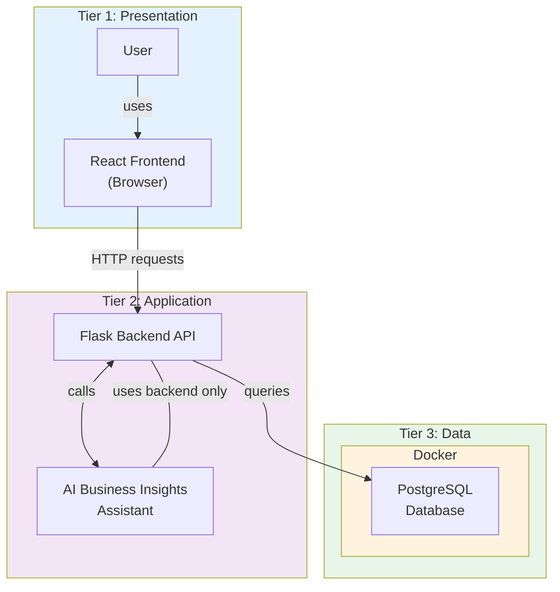

# iWear System Architecture – Week 1

## Request flow

1. **User → React → Flask API → PostgreSQL**  
   User actions in the browser hit the React app, which calls the Flask API; the API talks to PostgreSQL for data.

2. **AI Assistant**  
   The AI Business Insights Assistant lives inside the backend layer and interacts with the database only through the Flask backend (no direct DB access).

3. **Docker**  
   PostgreSQL runs inside a Docker container; the Flask API connects to it via the configured host/port (e.g. `127.0.0.1:5433`).
