# iWear End-to-End Business Workflow – Week 1

```mermaid
flowchart TD
    subgraph Procurement["1) Procurement"]
        P1["Supplier"]
        P2["Purchase Order"]
        P3["Stock In"]
        P4["Stock Ledger Update"]
        P1 --> P2 --> P3 --> P4
    end

    subgraph Sales["2) Sales"]
        S1["Customer"]
        S2["Product Selection"]
        S3["Prescription Entry"]
        S4["Sales Order"]
        S5["Payment"]
        S6["Stock Deduction"]
        S7["Accounting Entry"]
        S1 --> S2 --> S3 --> S4 --> S5 --> S6 --> S7
    end

    subgraph Finance["3) Finance"]
        F1["Voucher Creation"]
        F2["Ledger Posting"]
        F3["Financial Reporting"]
        F1 --> F2 --> F3
    end

    subgraph AI_Reporting["4) AI Reporting"]
        A1["Business User"]
        A2["Natural Language Query"]
        A3["Intent Detection"]
        A4["SQL Query"]
        A5["Report Output"]
        A1 --> A2 --> A3 --> A4 --> A5
    end
```

## Flow summary

| Flow | Steps |
|------|--------|
| **Procurement** | Supplier → Purchase Order → Stock In → Stock Ledger Update |
| **Sales** | Customer → Product Selection → Prescription Entry → Sales Order → Payment → Stock Deduction → Accounting Entry |
| **Finance** | Voucher Creation → Ledger Posting → Financial Reporting |
| **AI Reporting** | Business User → Natural Language Query → Intent Detection → SQL Query → Report Output |
