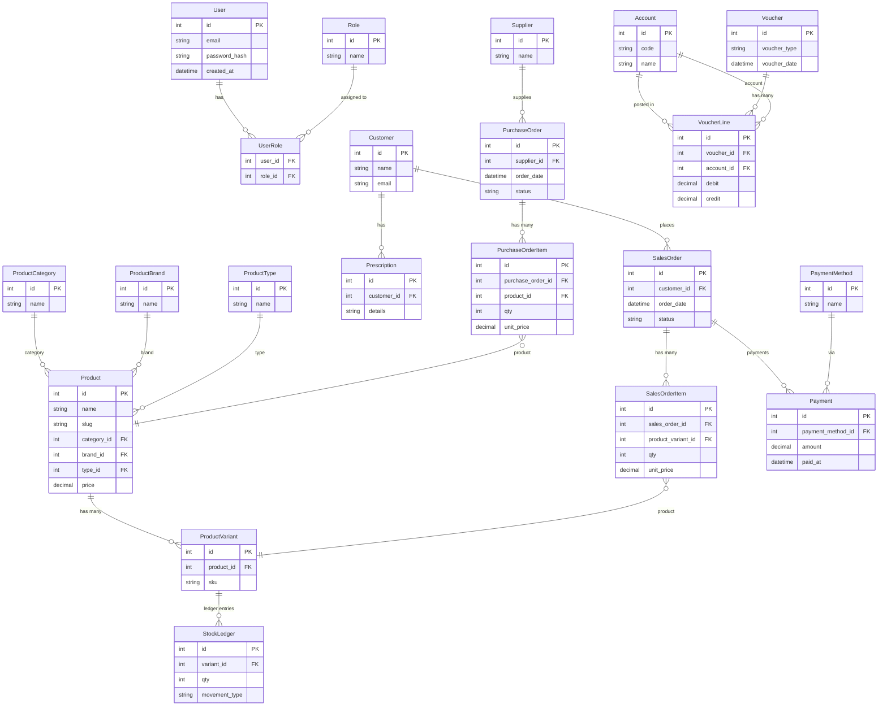

# iWear High-Level ER Design – Week 1

## Relationship summary

| From | To | Relationship |
|------|-----|--------------|
| User ↔ Role | UserRole | Many-to-many (UserRole links User and Role) |
| ProductCategory | Product | One-to-many (Product belongs to Category) |
| ProductBrand | Product | One-to-many (Product belongs to Brand) |
| ProductType | Product | One-to-many (Product belongs to Type) |
| Product | ProductVariant | One-to-many (Product has many Variants) |
| ProductVariant | StockLedger | One-to-many (Variant linked to StockLedger) |
| Customer | SalesOrder | One-to-many |
| SalesOrder | SalesOrderItem | One-to-many |
| SalesOrderItem | ProductVariant | Many-to-one (product) |
| Supplier | PurchaseOrder | One-to-many |
| PurchaseOrder | PurchaseOrderItem | One-to-many |
| PurchaseOrderItem | Product | Many-to-one (product) |
| Voucher | VoucherLine | One-to-many |
| VoucherLine | Account | Many-to-one |
| PaymentMethod | Payment | One-to-many |
| Customer | Prescription | One-to-many |
